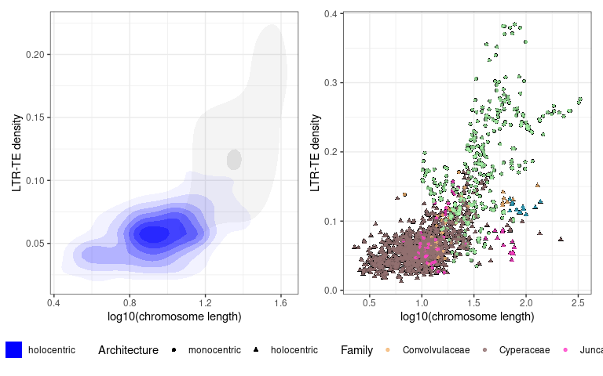
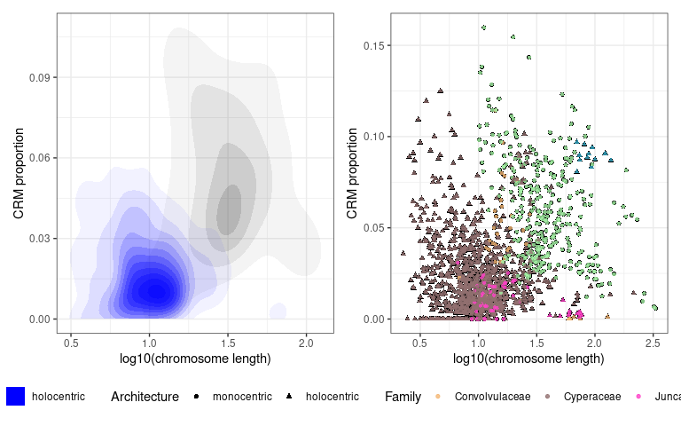
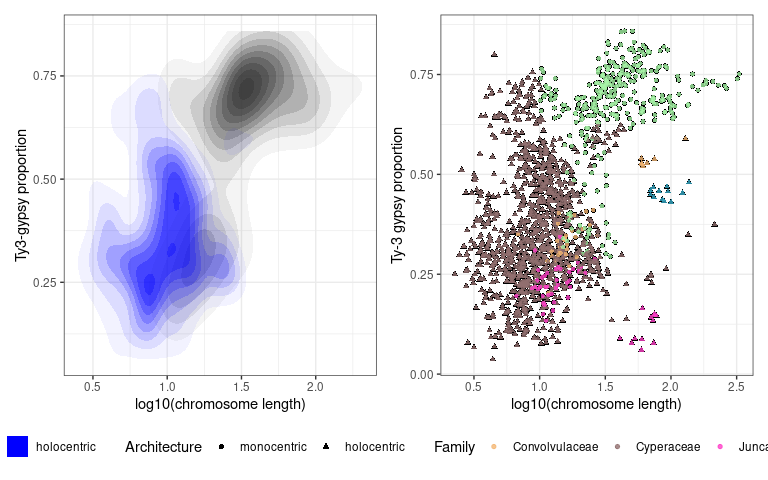
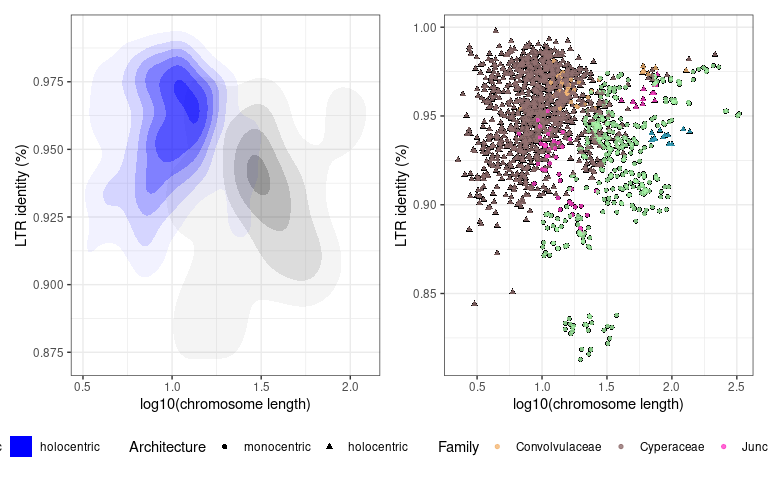
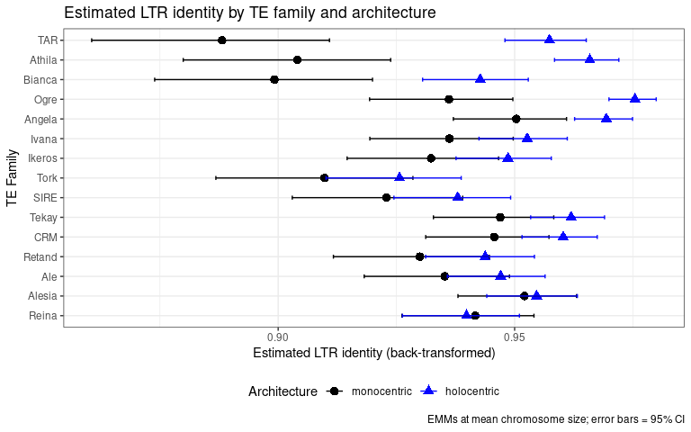
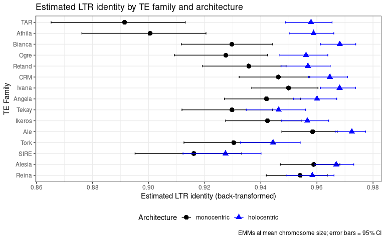
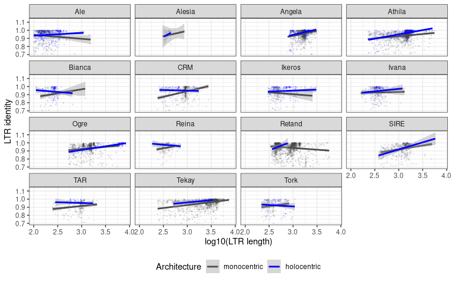
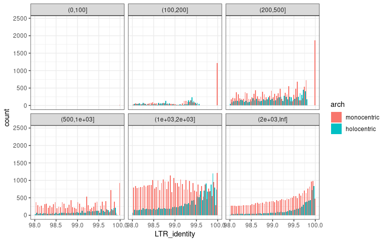
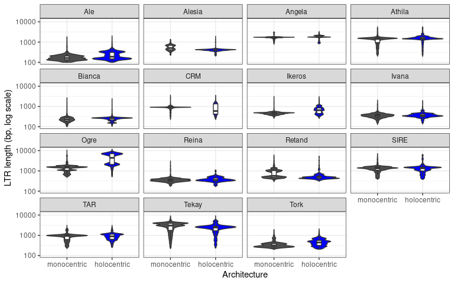

LTR-TE Dynamics — GLMM Analysis with TE Family Effects
================
Marie Kratka
2026-04-06

# Libraries

``` r
library(tidyverse)
library(data.table)
library(glmmTMB)
library(broom.mixed)
library(DHARMa)
library(knitr)
library(here)
library(patchwork)
library(svglite)
library(emmeans)
```

------------------------------------------------------------------------

# Load and prepare data

The mega-table has one row per LTR-TE element (intact, partial, or
solo_LTR), with element-level, window-level, chromosome-level, and
species-level metadata.

``` r
df_raw <- read_tsv(here("data", "df_for_linear_models.tsv"), show_col_types = FALSE)
```

``` r
df_raw <- df_raw %>%
  mutate(
    # monocentric as reference level
    arch = factor(Centromere_architecture,
                  levels = c("monocentric", "holocentric")),
    Family       = factor(Family),
    Ordo         = factor(Ordo),
    Clade        = factor(Clade),
    Genus        = factor(Genus),
    Species      = factor(Species),
    Class        = factor(Class),
    element_type = factor(element_type, levels = c("intact", "partial", "solo_LTR")),
    # Log chromosome size
    log_chr_length = log10(chr_length / 1e6)
  )
```

``` r
# TE family name (e.g. "Angela", "Athila", "CRM", "Tekay") from DANTE Class string
# Class column typically looks like: "Ty1/copia|Angela" or "Ty3/gypsy|chromovirus|Tekay|CRM"
# Adjust parsing to match your actual Class format

df_raw <- df_raw %>%
  mutate(
    # Extract the last element after the last "|" — this is typically the family name
    TE_family = str_extract(Class, "[^|]+$"),
    TE_family = factor(TE_family),
    # Superfamily: Ty1-copia vs Ty3-gypsy
    superfamily = case_when(
      grepl("Ty1/copia", Class, ignore.case = TRUE) ~ "Ty1-copia",
      grepl("Ty3/gypsy", Class, ignore.case = TRUE) ~ "Ty3-gypsy",
      TRUE ~ "other"
    ),
    superfamily = factor(superfamily)
  )

# Verify parsing
cat("TE family levels:\n")
```

    ## TE family levels:

``` r
print(sort(table(df_raw$TE_family), decreasing = TRUE))
```

    ## 
    ##    Retand    Athila    Angela     Tekay       Ale      SIRE      Ogre    Ikeros 
    ##    273752    190174    190055    176007    127097    103814    100818     65968 
    ##       CRM    Bianca     Ivana      Tork       TAR     Reina    Alesia Galadriel 
    ##     60526     53502     40886     31676     31057     30361      2490       144

``` r
cat("\nSuperfamily levels:\n")
```

    ## 
    ## Superfamily levels:

``` r
print(table(df_raw$superfamily))
```

    ## 
    ## Ty1-copia Ty3-gypsy 
    ##    646545    831782

## Sensitivity filter

``` r
sensitivity_exclude <- c(
  "Hordeum_vulgare",
  "Secale_cereale",
  "Triticum_aestivum",
  "Triticum_monococcum",
  "Rhynchospora_pubera"
)

df_full      <- df_raw
df_sensitive <- df_raw %>% filter(!Species %in% sensitivity_exclude)

cat("Full dataset:       ", n_distinct(df_full$Species),      "species\n")
```

    ## Full dataset:        67 species

``` r
cat("Sensitivity subset: ", n_distinct(df_sensitive$Species), "species\n")
```

    ## Sensitivity subset:  62 species

# load family palette

``` r
family_palette <- c(
  "Convolvulaceae" = "#f3b674",
  "Poaceae"        = "#a6f3a6",
  "Juncaceae"      = "#ff41c8",
  "Cyperaceae"     = "#916f6f",
  "Melanthiaceae"  = "#37abc8"
)
```

------------------------------------------------------------------------

# Aggregate to chromosome level

Used for hypotheses tested at chromosome level (H1–H4).

``` r
aggregate_chrom <- function(df) {
  df %>%
    group_by(Species, chr, chr_length, arch,
             Family, Ordo, Clade, Genus) %>%
    summarise(
      n_intact  = sum(element_type == "intact"),
      n_partial = sum(element_type == "partial"),
      n_solo    = sum(element_type == "solo_LTR"),
      n_total   = n(),

      solo_ratio = n_solo / (n_intact + n_solo),

      mean_LTR_identity = mean(LTR_identity[element_type == "intact"], na.rm = TRUE) / 100,

      TE_density = sum(end - start) / first(chr_length),
      crm_prop = sum(grepl("CRM", Class, ignore.case = TRUE)) / n_total,
      gypsy_prop = sum(grepl("Ty3-gypsy", superfamily, ignore.case = TRUE)) / n_total,

      .groups = "drop"
    ) %>%
    mutate(
      log_chr_length = log10(chr_length / 1e6),
      log_chr_length_c = log_chr_length - mean(log_chr_length, na.rm = TRUE),

      # Smithson & Verkuilen (2006) boundary correction for beta regression
      solo_ratio_adj   = (solo_ratio        * (n_total - 1) + 0.5) / n_total,
      ltr_identity_adj = (mean_LTR_identity * (n_total - 1) + 0.5) / n_total,
      TE_density_adj   = (TE_density        * (n_total - 1) + 0.5) / n_total,
      crm_prop_adj     = (crm_prop          * (n_total - 1) + 0.5) / n_total,
      gypsy_prop_adj   = (gypsy_prop        * (n_total -1) + 0.5) / n_total
    ) %>%
    filter(
      !is.na(solo_ratio),
      !is.na(mean_LTR_identity),
      !is.na(TE_density),
      n_intact >= 5
    )
}

chrom_full      <- aggregate_chrom(df_full)
chrom_sensitive <- aggregate_chrom(df_sensitive)

cat("Chromosomes (full):        ", nrow(chrom_full),      "\n")
```

    ## Chromosomes (full):         1534

``` r
cat("Chromosomes (sensitivity): ", nrow(chrom_sensitive), "\n")
```

    ## Chromosomes (sensitivity):  1522

``` r
chrom_full %>%
  group_by(arch) %>%
  summarise(
    n_species         = n_distinct(Species),
    n_chr             = n(),
    mean_solo_ratio   = mean(solo_ratio,        na.rm = TRUE),
    mean_ltr_identity = mean(mean_LTR_identity, na.rm = TRUE),
    mean_TE_density   = mean(TE_density,        na.rm = TRUE),
    .groups = "drop"
  ) %>%
  kable(digits = 4, caption = "Chromosome-level summary by architecture")
```

| arch        | n_species | n_chr | mean_solo_ratio | mean_ltr_identity | mean_TE_density |
|:------------|----------:|------:|----------------:|------------------:|----------------:|
| monocentric |        29 |   394 |          0.5443 |            0.9251 |          0.1620 |
| holocentric |        37 |  1140 |          0.7830 |            0.9526 |          0.0624 |

Chromosome-level summary by architecture

------------------------------------------------------------------------

# Aggregate to window level

Used for hypotheses tested at the window level (H1, H3). Keep distinct
LTR-TE families separate to allow family-level effects in the models.

``` r
aggregate_window <- function(df) {
  
  window_totals <- df %>%
    group_by(Species, chr, bin_ID, chr_length, arch, 
             Family, Ordo, Clade, Genus) %>%
    summarise(
      all_intact_count_in_window = sum(element_type == "intact"),
      all_disrupted_count_in_window = sum(element_type == "partial"),
      all_solo_count_in_window = sum(element_type == "solo_LTR"),
      all_total = n(),
      all_mean_LTR_identity_in_window = mean(LTR_identity[element_type == "intact"], na.rm = TRUE),
      .groups = "drop"
    ) %>%
    mutate(
      all_solo_intact_ratio_in_window = ifelse(all_intact_count_in_window + all_solo_count_in_window > 0,
                        all_solo_count_in_window / (all_intact_count_in_window + all_solo_count_in_window),
                        NA_real_),
      all_TE_density_in_window = all_intact_count_in_window / (0.05*chr_length),  # 5% window size
      log_chr_length = log10(chr_length / 1e6),
      log_chr_length_c = log_chr_length - mean(log_chr_length, na.rm = TRUE),
      
      # Verkuilen adjustment
      all_solo_intact_ratio_adj = ifelse(!is.na(all_solo_intact_ratio_in_window),
                        (all_solo_intact_ratio_in_window * (all_total - 1) + 0.5) / all_total,
                        NA_real_)
  )
  
}

window_sensitive <- aggregate_window(df_sensitive)
window_full <- aggregate_window(df_full)
cat("Windows included sensitive:", nrow(window_sensitive), "\n")
```

    ## Windows included sensitive: 131989

``` r
cat("Windows included full:", nrow(window_full), "\n")
```

    ## Windows included full: 133152

------------------------------------------------------------------------

# Filter to element level

TE_density_adj = (TE_density \* (n_total - 1) + 0.5) / n_total,

``` r
prep_element_data <- function(df, min_family_n = 100) {
  out <- df %>%
    filter(
      element_type == "intact",
      !is.na(LTR_identity),
      !is.na(log_chr_length),
      !is.na(arch),
      !is.na(Class)
    ) %>%
    mutate(
      LTRi_prop = (LTR_identity/100 * (LTR_length - 1) + 0.5) / LTR_length,
      log_chr_length_c = log_chr_length - mean(log_chr_length, na.rm = TRUE),
      log_LTR_length = log10(LTR_length + 1e-6)
    )

  cat("Intact elements:", nrow(out), "\n")
  cat("TE families present:\n")
  print(sort(table(out$Class), decreasing = TRUE))

  family_counts <- out %>% count(Class) %>% filter(n >= min_family_n)
  cat("\nFamilies with >=", min_family_n, "elements:", nrow(family_counts), "\n")

  out <- out %>%
    filter(Class %in% family_counts$Class) %>%
    mutate(Class = droplevels(Class))

  cat("Elements after family filter:", nrow(out), "\n")
  out
}

element_full      <- prep_element_data(df_full)
```

    ## Intact elements: 414887 
    ## TE families present:
    ## 
    ## Ty3/gypsy|non-chromovirus|OTA|Tat|Retand 
    ##                                    74819 
    ##                         Ty1/copia|Angela 
    ##                                    71614 
    ##     Ty3/gypsy|non-chromovirus|OTA|Athila 
    ##                                    61495 
    ##              Ty3/gypsy|chromovirus|Tekay 
    ##                                    54958 
    ##   Ty3/gypsy|non-chromovirus|OTA|Tat|Ogre 
    ##                                    31460 
    ##                            Ty1/copia|Ale 
    ##                                    30734 
    ##                Ty3/gypsy|chromovirus|CRM 
    ##                                    16864 
    ##                           Ty1/copia|SIRE 
    ##                                    16540 
    ##                         Ty1/copia|Ikeros 
    ##                                    13970 
    ##                          Ty1/copia|Ivana 
    ##                                    12480 
    ##                            Ty1/copia|TAR 
    ##                                     8519 
    ##                         Ty1/copia|Bianca 
    ##                                     7794 
    ##                           Ty1/copia|Tork 
    ##                                     6647 
    ##              Ty3/gypsy|chromovirus|Reina 
    ##                                     6149 
    ##                         Ty1/copia|Alesia 
    ##                                      816 
    ##          Ty3/gypsy|chromovirus|Galadriel 
    ##                                       28 
    ## 
    ## Families with >= 100 elements: 15 
    ## Elements after family filter: 414859

``` r
element_sensitive <- prep_element_data(df_sensitive)
```

    ## Intact elements: 299816 
    ## TE families present:
    ## 
    ## Ty3/gypsy|non-chromovirus|OTA|Tat|Retand 
    ##                                    56590 
    ##              Ty3/gypsy|chromovirus|Tekay 
    ##                                    42177 
    ##     Ty3/gypsy|non-chromovirus|OTA|Athila 
    ##                                    35159 
    ##                         Ty1/copia|Angela 
    ##                                    31465 
    ##   Ty3/gypsy|non-chromovirus|OTA|Tat|Ogre 
    ##                                    31198 
    ##                            Ty1/copia|Ale 
    ##                                    27289 
    ##                Ty3/gypsy|chromovirus|CRM 
    ##                                    13321 
    ##                         Ty1/copia|Ikeros 
    ##                                    12921 
    ##                          Ty1/copia|Ivana 
    ##                                    11446 
    ##                           Ty1/copia|SIRE 
    ##                                    11138 
    ##                            Ty1/copia|TAR 
    ##                                     7655 
    ##                         Ty1/copia|Bianca 
    ##                                     7242 
    ##                           Ty1/copia|Tork 
    ##                                     6039 
    ##              Ty3/gypsy|chromovirus|Reina 
    ##                                     5474 
    ##                         Ty1/copia|Alesia 
    ##                                      674 
    ##          Ty3/gypsy|chromovirus|Galadriel 
    ##                                       28 
    ## 
    ## Families with >= 100 elements: 15 
    ## Elements after family filter: 299788

|                                                                                                                                                                                                                                                                                                                                                                                                                                                                                                                                                                                                                                                                                                                                                                                                                                                                                                                                                                                                                                                                                                                                                                                                                                                                                                                                                                                                                                                                                                                                                                                                                                                                             |
|:----------------------------------------------------------------------------------------------------------------------------------------------------------------------------------------------------------------------------------------------------------------------------------------------------------------------------------------------------------------------------------------------------------------------------------------------------------------------------------------------------------------------------------------------------------------------------------------------------------------------------------------------------------------------------------------------------------------------------------------------------------------------------------------------------------------------------------------------------------------------------------------------------------------------------------------------------------------------------------------------------------------------------------------------------------------------------------------------------------------------------------------------------------------------------------------------------------------------------------------------------------------------------------------------------------------------------------------------------------------------------------------------------------------------------------------------------------------------------------------------------------------------------------------------------------------------------------------------------------------------------------------------------------------------------|
| \# H1a: overall TE density                                                                                                                                                                                                                                                                                                                                                                                                                                                                                                                                                                                                                                                                                                                                                                                                                                                                                                                                                                                                                                                                                                                                                                                                                                                                                                                                                                                                                                                                                                                                                                                                                                                  |
| `r h1a_additive <- glmmTMB(TE_density_adj ~ arch + log_chr_length_c + (1 | Ordo/Family/Genus/Species), family = beta_family(), dispformula = ~arch, data = chrom_sensitive) summary(h1a_additive)`                                                                                                                                                                                                                                                                                                                                                                                                                                                                                                                                                                                                                                                                                                                                                                                                                                                                                                                                                                                                                                                                                                                                                                                                                                                                                                                                                                                                                                                                          |
| `##  Family: beta  ( logit ) ## Formula: ## TE_density_adj ~ arch + log_chr_length_c + (1 | Ordo/Family/Genus/Species) ## Dispersion:                      ~arch ## Data: chrom_sensitive ## ##       AIC       BIC    logLik -2*log(L)  df.resid ##   -8562.4   -8514.4    4290.2   -8580.4      1513 ## ## Random effects: ## ## Conditional model: ##  Groups                    Name        Variance  Std.Dev. ##  Species:Genus:Family:Ordo (Intercept) 1.514e-01 0.3890687 ##  Genus:Family:Ordo         (Intercept) 5.275e-03 0.0726298 ##  Family:Ordo               (Intercept) 5.235e-02 0.2288020 ##  Ordo                      (Intercept) 5.286e-08 0.0002299 ## Number of obs: 1522, groups: ## Species:Genus:Family:Ordo, 61; Genus:Family:Ordo, 18; Family:Ordo, 5; Ordo, 3 ## ## Conditional model: ##                  Estimate Std. Error z value Pr(>|z|) ## (Intercept)      -2.06009    0.23559  -8.745  < 2e-16 *** ## archholocentric  -0.42787    0.35584  -1.202    0.229 ## log_chr_length_c  0.23118    0.03987   5.799 6.68e-09 *** ## --- ## Signif. codes:  0 '***' 0.001 '**' 0.01 '*' 0.05 '.' 0.1 ' ' 1 ## ## Dispersion model: ##                 Estimate Std. Error z value Pr(>|z|) ## (Intercept)      4.93810    0.07465   66.15   <2e-16 *** ## archholocentric  1.37833    0.08601   16.03   <2e-16 *** ## --- ## Signif. codes:  0 '***' 0.001 '**' 0.01 '*' 0.05 '.' 0.1 ' ' 1`                                                                                                                                                                                                                                                 |
| `r h1a_interaction <- glmmTMB(TE_density_adj ~ arch * log_chr_length_c + (1 | Ordo/Family/Genus/Species), family = beta_family(), dispformula = ~arch, data = chrom_sensitive) summary(h1a_interaction)`                                                                                                                                                                                                                                                                                                                                                                                                                                                                                                                                                                                                                                                                                                                                                                                                                                                                                                                                                                                                                                                                                                                                                                                                                                                                                                                                                                                                                                                                    |
| `##  Family: beta  ( logit ) ## Formula: ## TE_density_adj ~ arch * log_chr_length_c + (1 | Ordo/Family/Genus/Species) ## Dispersion:                      ~arch ## Data: chrom_sensitive ## ##       AIC       BIC    logLik -2*log(L)  df.resid ##   -8561.6   -8508.4    4290.8   -8581.6      1512 ## ## Random effects: ## ## Conditional model: ##  Groups                    Name        Variance  Std.Dev. ##  Species:Genus:Family:Ordo (Intercept) 1.541e-01 0.39253 ##  Genus:Family:Ordo         (Intercept) 1.053e-02 0.10261 ##  Family:Ordo               (Intercept) 6.087e-02 0.24671 ##  Ordo                      (Intercept) 1.231e-06 0.00111 ## Number of obs: 1522, groups: ## Species:Genus:Family:Ordo, 61; Genus:Family:Ordo, 18; Family:Ordo, 5; Ordo, 3 ## ## Conditional model: ##                                  Estimate Std. Error z value Pr(>|z|) ## (Intercept)                       -2.0425     0.2438  -8.379   <2e-16 *** ## archholocentric                   -0.4363     0.3561  -1.225    0.220 ## log_chr_length_c                   0.1259     0.1016   1.240    0.215 ## archholocentric:log_chr_length_c   0.1229     0.1092   1.125    0.261 ## --- ## Signif. codes:  0 '***' 0.001 '**' 0.01 '*' 0.05 '.' 0.1 ' ' 1 ## ## Dispersion model: ##                 Estimate Std. Error z value Pr(>|z|) ## (Intercept)      4.94869    0.07484   66.12   <2e-16 *** ## archholocentric  1.36771    0.08616   15.87   <2e-16 *** ## --- ## Signif. codes:  0 '***' 0.001 '**' 0.01 '*' 0.05 '.' 0.1 ' ' 1` Additive model has better BIC. Architecture has no effect, chromosome size associated with increased TE abundance. |
| Is there a difference on chrom_full?                                                                                                                                                                                                                                                                                                                                                                                                                                                                                                                                                                                                                                                                                                                                                                                                                                                                                                                                                                                                                                                                                                                                                                                                                                                                                                                                                                                                                                                                                                                                                                                                                                        |
| `r h1a_full <- glmmTMB(TE_density_adj ~ arch + log_chr_length_c + (1 | Ordo/Family/Genus/Species), family = beta_family(), dispformula = ~arch, data = chrom_full) summary(h1a_full)`                                                                                                                                                                                                                                                                                                                                                                                                                                                                                                                                                                                                                                                                                                                                                                                                                                                                                                                                                                                                                                                                                                                                                                                                                                                                                                                                                                                                                                                                                       |
| `##  Family: beta  ( logit ) ## Formula: ## TE_density_adj ~ arch + log_chr_length_c + (1 | Ordo/Family/Genus/Species) ## Dispersion:                      ~arch ## Data: chrom_full ## ##       AIC       BIC    logLik -2*log(L)  df.resid ##   -8612.7   -8564.7    4315.3   -8630.7      1525 ## ## Random effects: ## ## Conditional model: ##  Groups                    Name        Variance  Std.Dev. ##  Species:Genus:Family:Ordo (Intercept) 1.530e-01 3.911e-01 ##  Genus:Family:Ordo         (Intercept) 4.461e-07 6.679e-04 ##  Family:Ordo               (Intercept) 7.103e-02 2.665e-01 ##  Ordo                      (Intercept) 4.884e-14 2.210e-07 ## Number of obs: 1534, groups: ## Species:Genus:Family:Ordo, 66; Genus:Family:Ordo, 21; Family:Ordo, 5; Ordo, 3 ## ## Conditional model: ##                  Estimate Std. Error z value Pr(>|z|) ## (Intercept)      -2.05452    0.23583  -8.712  < 2e-16 *** ## archholocentric  -0.41105    0.33430  -1.230    0.219 ## log_chr_length_c  0.24414    0.03859   6.327  2.5e-10 *** ## --- ## Signif. codes:  0 '***' 0.001 '**' 0.01 '*' 0.05 '.' 0.1 ' ' 1 ## ## Dispersion model: ##                 Estimate Std. Error z value Pr(>|z|) ## (Intercept)      4.94235    0.07441   66.42   <2e-16 *** ## archholocentric  1.37761    0.08573   16.07   <2e-16 *** ## --- ## Signif. codes:  0 '***' 0.001 '**' 0.01 '*' 0.05 '.' 0.1 ' ' 1` Nope.                                                                                                                                                                                                                                                |
| Now visualize the distribution                                                                                                                                                                                                                                                                                                                                                                                                                                                                                                                                                                                                                                                                                                                                                                                                                                                                                                                                                                                                                                                                                                                                                                                                                                                                                                                                                                                                                                                                                                                                                                                                                                              |
| \`\`\`r p_density \<- chrom_sensitive %\>% ggplot(aes(x = log_chr_length, y = TE_density)) + stat_density_2d( aes(fill = arch, alpha = after_stat(level)), geom = “polygon” ) + scale_fill_manual(values = c(“monocentric” = “gray20”, “holocentric” = “blue”)) + scale_alpha_continuous(range = c(0.05, 0.4)) + labs(x = “log10(chromosome length)”, y = “LTR-TE density”, fill = “Architecture”) + guides(alpha = “none”) + theme_bw() + theme(text = element_text(family = “Arial”))                                                                                                                                                                                                                                                                                                                                                                                                                                                                                                                                                                                                                                                                                                                                                                                                                                                                                                                                                                                                                                                                                                                                                                                     |
| p_points \<- chrom_sensitive %\>% ggplot(aes(x = log_chr_length, y = TE_density)) + geom_point(aes(shape = arch), color = “black”, size = 1.5) + geom_point(aes(color = Family, shape = arch), size = 1.2, alpha = 0.8) + scale_color_manual(values = family_palette) + scale_shape_manual(values = c(“holocentric” = 17, “monocentric” = 16)) + labs(x = “log10(chromosome length)”, y = “LTR-TE density”, color = “Family”, shape = “Architecture”) + theme_bw() + theme(text = element_text(family = “Arial”))                                                                                                                                                                                                                                                                                                                                                                                                                                                                                                                                                                                                                                                                                                                                                                                                                                                                                                                                                                                                                                                                                                                                                           |
| p_combined \<- p_density + p_points + plot_layout(guides = “collect”) & theme(legend.position = “bottom”, text = element_text(family = “Arial”)) ggsave(“../../data/figures/GLMM/te_density_vs_chr_size.svg”, plot = p_combined, width = 8, height = 5, device = svglite) p_combined \`\`\`                                                                                                                                                                                                                                                                                                                                                                                                                                                                                                                                                                                                                                                                                                                                                                                                                                                                                                                                                                                                                                                                                                                                                                                                                                                                                                                                                                                 |
| <!-- -->                                                                                                                                                                                                                                                                                                                                                                                                                                                                                                                                                                                                                                                                                                                                                                                                                                                                                                                                                                                                                                                                                                                                                                                                                                                                                                                                                                                                                                                                                                                                                                                             |
| And export the effects estimation table                                                                                                                                                                                                                                                                                                                                                                                                                                                                                                                                                                                                                                                                                                                                                                                                                                                                                                                                                                                                                                                                                                                                                                                                                                                                                                                                                                                                                                                                                                                                                                                                                                     |
| `r tidy(h1a_additive, effects = "fixed", conf.int = TRUE) |> write_csv("../../data/tables/glmm/h1a.csv")`                                                                                                                                                                                                                                                                                                                                                                                                                                                                                                                                                                                                                                                                                                                                                                                                                                                                                                                                                                                                                                                                                                                                                                                                                                                                                                                                                                                                                                                                                                                                                                   |

# H1b: CRM proportions

not enough elements in individual windows, calculate on chromosome level

``` r
h1b_additive <- glmmTMB(crm_prop_adj ~ arch + log_chr_length_c +
          (1 | Ordo/Family/Genus/Species),
        family = beta_family(),
        dispformula = ~arch,
        data = chrom_sensitive)
summary(h1b_additive)
```

    ##  Family: beta  ( logit )
    ## Formula:          
    ## crm_prop_adj ~ arch + log_chr_length_c + (1 | Ordo/Family/Genus/Species)
    ## Dispersion:                    ~arch
    ## Data: chrom_sensitive
    ## 
    ##       AIC       BIC    logLik -2*log(L)  df.resid 
    ##   -9168.1   -9120.1    4593.0   -9186.1      1513 
    ## 
    ## Random effects:
    ## 
    ## Conditional model:
    ##  Groups                    Name        Variance  Std.Dev.
    ##  Species:Genus:Family:Ordo (Intercept) 2.200e-01 0.469006
    ##  Genus:Family:Ordo         (Intercept) 9.988e-02 0.316037
    ##  Family:Ordo               (Intercept) 9.683e-01 0.984034
    ##  Ordo                      (Intercept) 1.471e-06 0.001213
    ## Number of obs: 1522, groups:  
    ## Species:Genus:Family:Ordo, 61; Genus:Family:Ordo, 18; Family:Ordo, 5; Ordo, 3
    ## 
    ## Conditional model:
    ##                  Estimate Std. Error z value Pr(>|z|)    
    ## (Intercept)      -2.70132    0.56375  -4.792 1.65e-06 ***
    ## archholocentric  -1.39866    0.53437  -2.617 0.008861 ** 
    ## log_chr_length_c -0.31410    0.08433  -3.725 0.000195 ***
    ## ---
    ## Signif. codes:  0 '***' 0.001 '**' 0.01 '*' 0.05 '.' 0.1 ' ' 1
    ## 
    ## Dispersion model:
    ##                 Estimate Std. Error z value Pr(>|z|)    
    ## (Intercept)      5.58515    0.07520   74.27  < 2e-16 ***
    ## archholocentric -0.63636    0.08735   -7.29 3.21e-13 ***
    ## ---
    ## Signif. codes:  0 '***' 0.001 '**' 0.01 '*' 0.05 '.' 0.1 ' ' 1

``` r
h1b_interaction <- glmmTMB(crm_prop_adj ~ arch * log_chr_length_c +
          (1 | Ordo/Family/Genus/Species),
        family = beta_family(),
        dispformula = ~arch,
        data = chrom_sensitive)
summary(h1b_interaction)
```

    ##  Family: beta  ( logit )
    ## Formula:          
    ## crm_prop_adj ~ arch * log_chr_length_c + (1 | Ordo/Family/Genus/Species)
    ## Dispersion:                    ~arch
    ## Data: chrom_sensitive
    ## 
    ##       AIC       BIC    logLik -2*log(L)  df.resid 
    ##   -9174.3   -9121.1    4597.2   -9194.3      1512 
    ## 
    ## Random effects:
    ## 
    ## Conditional model:
    ##  Groups                    Name        Variance  Std.Dev.
    ##  Species:Genus:Family:Ordo (Intercept) 2.225e-01 0.471712
    ##  Genus:Family:Ordo         (Intercept) 8.230e-02 0.286883
    ##  Family:Ordo               (Intercept) 9.948e-01 0.997373
    ##  Ordo                      (Intercept) 1.079e-06 0.001039
    ## Number of obs: 1522, groups:  
    ## Species:Genus:Family:Ordo, 61; Genus:Family:Ordo, 18; Family:Ordo, 5; Ordo, 3
    ## 
    ## Conditional model:
    ##                                  Estimate Std. Error z value Pr(>|z|)    
    ## (Intercept)                       -2.6550     0.5652  -4.697 2.64e-06 ***
    ## archholocentric                   -1.5631     0.5330  -2.932  0.00336 ** 
    ## log_chr_length_c                  -0.5250     0.1113  -4.717 2.40e-06 ***
    ## archholocentric:log_chr_length_c   0.4831     0.1677   2.881  0.00397 ** 
    ## ---
    ## Signif. codes:  0 '***' 0.001 '**' 0.01 '*' 0.05 '.' 0.1 ' ' 1
    ## 
    ## Dispersion model:
    ##                 Estimate Std. Error z value Pr(>|z|)    
    ## (Intercept)      5.59570    0.07479   74.82  < 2e-16 ***
    ## archholocentric -0.64435    0.08683   -7.42 1.16e-13 ***
    ## ---
    ## Signif. codes:  0 '***' 0.001 '**' 0.01 '*' 0.05 '.' 0.1 ' ' 1

Interaction is better. In monocentrics, CRM goes down with chr size.
There is fewer CRM in holocentrics.

``` r
h1b_full <- glmmTMB(crm_prop_adj ~ arch * log_chr_length_c +
          (1 | Ordo/Family/Genus/Species),
        family = beta_family(),
        dispformula = ~arch,
        data = chrom_full)
summary(h1b_full)
```

    ##  Family: beta  ( logit )
    ## Formula:          
    ## crm_prop_adj ~ arch * log_chr_length_c + (1 | Ordo/Family/Genus/Species)
    ## Dispersion:                    ~arch
    ## Data: chrom_full
    ## 
    ##       AIC       BIC    logLik -2*log(L)  df.resid 
    ##   -9239.3   -9186.0    4629.7   -9259.3      1524 
    ## 
    ## Random effects:
    ## 
    ## Conditional model:
    ##  Groups                    Name        Variance  Std.Dev. 
    ##  Species:Genus:Family:Ordo (Intercept) 2.236e-01 0.4728307
    ##  Genus:Family:Ordo         (Intercept) 8.930e-02 0.2988340
    ##  Family:Ordo               (Intercept) 9.980e-01 0.9990221
    ##  Ordo                      (Intercept) 9.383e-07 0.0009687
    ## Number of obs: 1534, groups:  
    ## Species:Genus:Family:Ordo, 66; Genus:Family:Ordo, 21; Family:Ordo, 5; Ordo, 3
    ## 
    ## Conditional model:
    ##                                  Estimate Std. Error z value Pr(>|z|)    
    ## (Intercept)                       -2.6440     0.5668  -4.664 3.09e-06 ***
    ## archholocentric                   -1.5868     0.5364  -2.958  0.00309 ** 
    ## log_chr_length_c                  -0.5238     0.1040  -5.038 4.70e-07 ***
    ## archholocentric:log_chr_length_c   0.5084     0.1610   3.158  0.00159 ** 
    ## ---
    ## Signif. codes:  0 '***' 0.001 '**' 0.01 '*' 0.05 '.' 0.1 ' ' 1
    ## 
    ## Dispersion model:
    ##                 Estimate Std. Error z value Pr(>|z|)    
    ## (Intercept)      5.58977    0.07458   74.95  < 2e-16 ***
    ## archholocentric -0.63498    0.08659   -7.33 2.24e-13 ***
    ## ---
    ## Signif. codes:  0 '***' 0.001 '**' 0.01 '*' 0.05 '.' 0.1 ' ' 1

Same result for full dataset

``` r
p_density <- chrom_sensitive %>%
  ggplot(aes(x = log_chr_length, y = crm_prop)) +
  stat_density_2d(
    aes(fill = arch, alpha = after_stat(level)),
    geom = "polygon"
  ) +
  scale_fill_manual(values = c("monocentric" = "gray20",
                               "holocentric" = "blue")) +
  scale_alpha_continuous(range = c(0.05, 0.4)) +
  labs(x = "log10(chromosome length)", y = "CRM proportion",
       fill = "Architecture") +
  guides(alpha = "none") +
  theme_bw() +
  theme(text = element_text(family = "Arial"))

p_points <- chrom_sensitive %>%
  ggplot(aes(x = log_chr_length, y = crm_prop)) +
  geom_point(aes(shape = arch),
             color = "black", size = 1.5) +
  geom_point(aes(color = Family, shape = arch),
             size = 1.2, alpha = 0.8) +
  scale_color_manual(values = family_palette) +
  scale_shape_manual(values = c("holocentric" = 17,
                                "monocentric" = 16)) +
  labs(x = "log10(chromosome length)", y = "CRM proportion",
       color = "Family", shape = "Architecture") +
  theme_bw() +
  theme(text = element_text(family = "Arial"))

p_combined <- p_density + p_points +
  plot_layout(guides = "collect") &
  theme(legend.position = "bottom",
        text = element_text(family = "Arial"))
ggsave("../../data/figures/GLMM/crmprop_vs_chr_size.svg", plot = p_combined,
       width = 8, height = 5, device = svglite)
p_combined
```

<!-- -->

Export results

``` r
tidy(h1b_interaction, effects = "fixed", conf.int = TRUE) |>
write_csv("../../data/tables/glmm/h1b.csv")
```

# H1c Gypsy proportion

``` r
h1c_additive <- glmmTMB(gypsy_prop_adj ~ arch + log_chr_length_c +
          (1 | Ordo/Family/Genus/Species),
        family = beta_family(),
        dispformula = ~arch,
        data = chrom_sensitive)
summary(h1c_additive)
```

    ##  Family: beta  ( logit )
    ## Formula:          
    ## gypsy_prop_adj ~ arch + log_chr_length_c + (1 | Ordo/Family/Genus/Species)
    ## Dispersion:                      ~arch
    ## Data: chrom_sensitive
    ## 
    ##       AIC       BIC    logLik -2*log(L)  df.resid 
    ##   -4993.0   -4945.0    2505.5   -5011.0      1513 
    ## 
    ## Random effects:
    ## 
    ## Conditional model:
    ##  Groups                    Name        Variance  Std.Dev. 
    ##  Species:Genus:Family:Ordo (Intercept) 3.022e-01 0.5497405
    ##  Genus:Family:Ordo         (Intercept) 1.040e-08 0.0001020
    ##  Family:Ordo               (Intercept) 4.628e-01 0.6803153
    ##  Ordo                      (Intercept) 1.409e-08 0.0001187
    ## Number of obs: 1522, groups:  
    ## Species:Genus:Family:Ordo, 61; Genus:Family:Ordo, 18; Family:Ordo, 5; Ordo, 3
    ## 
    ## Conditional model:
    ##                  Estimate Std. Error z value Pr(>|z|)   
    ## (Intercept)      -0.14976    0.40857  -0.366  0.71397   
    ## archholocentric  -0.48970    0.41185  -1.189  0.23443   
    ## log_chr_length_c  0.12177    0.04287   2.840  0.00451 **
    ## ---
    ## Signif. codes:  0 '***' 0.001 '**' 0.01 '*' 0.05 '.' 0.1 ' ' 1
    ## 
    ## Dispersion model:
    ##                 Estimate Std. Error z value Pr(>|z|)    
    ## (Intercept)      5.17864    0.07416   69.83  < 2e-16 ***
    ## archholocentric -0.57821    0.08551   -6.76 1.36e-11 ***
    ## ---
    ## Signif. codes:  0 '***' 0.001 '**' 0.01 '*' 0.05 '.' 0.1 ' ' 1

``` r
h1c_interaction <- glmmTMB(gypsy_prop_adj ~ arch * log_chr_length_c +
          (1 | Ordo/Family/Genus/Species),
        family = beta_family(),
        dispformula = ~arch,
        data = chrom_sensitive)
summary(h1c_interaction)
```

    ##  Family: beta  ( logit )
    ## Formula:          
    ## gypsy_prop_adj ~ arch * log_chr_length_c + (1 | Ordo/Family/Genus/Species)
    ## Dispersion:                      ~arch
    ## Data: chrom_sensitive
    ## 
    ##       AIC       BIC    logLik -2*log(L)  df.resid 
    ##   -4992.6   -4939.3    2506.3   -5012.6      1512 
    ## 
    ## Random effects:
    ## 
    ## Conditional model:
    ##  Groups                    Name        Variance  Std.Dev. 
    ##  Species:Genus:Family:Ordo (Intercept) 2.999e-01 5.477e-01
    ##  Genus:Family:Ordo         (Intercept) 7.086e-09 8.418e-05
    ##  Family:Ordo               (Intercept) 4.489e-01 6.700e-01
    ##  Ordo                      (Intercept) 8.639e-09 9.294e-05
    ## Number of obs: 1522, groups:  
    ## Species:Genus:Family:Ordo, 61; Genus:Family:Ordo, 18; Family:Ordo, 5; Ordo, 3
    ## 
    ## Conditional model:
    ##                                  Estimate Std. Error z value Pr(>|z|)   
    ## (Intercept)                      -0.16611    0.40413  -0.411  0.68104   
    ## archholocentric                  -0.45836    0.41037  -1.117  0.26402   
    ## log_chr_length_c                  0.19394    0.07097   2.733  0.00628 **
    ## archholocentric:log_chr_length_c -0.11363    0.08906  -1.276  0.20197   
    ## ---
    ## Signif. codes:  0 '***' 0.001 '**' 0.01 '*' 0.05 '.' 0.1 ' ' 1
    ## 
    ## Dispersion model:
    ##                 Estimate Std. Error z value Pr(>|z|)    
    ## (Intercept)      5.18023    0.07412   69.89  < 2e-16 ***
    ## archholocentric -0.57938    0.08544   -6.78 1.19e-11 ***
    ## ---
    ## Signif. codes:  0 '***' 0.001 '**' 0.01 '*' 0.05 '.' 0.1 ' ' 1

Additive is better. The gypsy proportion goes up in larger chromosomes
(both groups). No difference between mono and holocentrics.

``` r
h1c_full <- glmmTMB(gypsy_prop_adj ~ arch + log_chr_length_c +
          (1 | Ordo/Family/Genus/Species),
        family = beta_family(),
        dispformula = ~arch,
        data = chrom_full)
summary(h1c_full)
```

    ##  Family: beta  ( logit )
    ## Formula:          
    ## gypsy_prop_adj ~ arch + log_chr_length_c + (1 | Ordo/Family/Genus/Species)
    ## Dispersion:                      ~arch
    ## Data: chrom_full
    ## 
    ##       AIC       BIC    logLik -2*log(L)  df.resid 
    ##   -5029.5   -4981.4    2523.7   -5047.5      1525 
    ## 
    ## Random effects:
    ## 
    ## Conditional model:
    ##  Groups                    Name        Variance  Std.Dev. 
    ##  Species:Genus:Family:Ordo (Intercept) 2.866e-01 5.353e-01
    ##  Genus:Family:Ordo         (Intercept) 7.946e-09 8.914e-05
    ##  Family:Ordo               (Intercept) 4.483e-01 6.695e-01
    ##  Ordo                      (Intercept) 9.512e-09 9.753e-05
    ## Number of obs: 1534, groups:  
    ## Species:Genus:Family:Ordo, 66; Genus:Family:Ordo, 21; Family:Ordo, 5; Ordo, 3
    ## 
    ## Conditional model:
    ##                  Estimate Std. Error z value Pr(>|z|)   
    ## (Intercept)      -0.16613    0.40007  -0.415  0.67795   
    ## archholocentric  -0.47405    0.40131  -1.181  0.23750   
    ## log_chr_length_c  0.11298    0.04183   2.701  0.00692 **
    ## ---
    ## Signif. codes:  0 '***' 0.001 '**' 0.01 '*' 0.05 '.' 0.1 ' ' 1
    ## 
    ## Dispersion model:
    ##                 Estimate Std. Error z value Pr(>|z|)    
    ## (Intercept)      5.18510    0.07384   70.22  < 2e-16 ***
    ## archholocentric -0.58105    0.08518   -6.82 9.03e-12 ***
    ## ---
    ## Signif. codes:  0 '***' 0.001 '**' 0.01 '*' 0.05 '.' 0.1 ' ' 1

``` r
p_density <- chrom_sensitive %>%
  ggplot(aes(x = log_chr_length, y = gypsy_prop)) +
  stat_density_2d(
    aes(fill = arch, alpha = after_stat(level)),
    geom = "polygon"
  ) +
  scale_fill_manual(values = c("monocentric" = "gray20",
                               "holocentric" = "blue")) +
  scale_alpha_continuous(range = c(0.05, 0.4)) +
  labs(x = "log10(chromosome length)", y = "Ty3-gypsy proportion",
       fill = "Architecture") +
  guides(alpha = "none") +
  theme_bw() +
  theme(text = element_text(family = "Arial"))

p_points <- chrom_sensitive %>%
  ggplot(aes(x = log_chr_length, y = gypsy_prop)) +
  geom_point(aes(shape = arch),
             color = "black", size = 1.5) +
  geom_point(aes(color = Family, shape = arch),
             size = 1.2, alpha = 0.8) +
  scale_color_manual(values = family_palette) +
  scale_shape_manual(values = c("holocentric" = 17,
                                "monocentric" = 16)) +
  labs(x = "log10(chromosome length)", y = "Ty-3 gypsy proportion",
       color = "Family", shape = "Architecture") +
  theme_bw() +
  theme(text = element_text(family = "Arial"))

p_combined <- p_density + p_points +
  plot_layout(guides = "collect") &
  theme(legend.position = "bottom",
        text = element_text(family = "Arial"))
ggsave("../../data/figures/GLMM/gypsyprop_vs_chr_size.svg", plot = p_combined,
       width = 8, height = 5, device = svglite)
p_combined
```

<!-- -->

|                                                                                                                                                                                                                                                                                                                                                                                                                                                                                                                                                                                                                                                                                                                                                                                                                                                                                                                                                                                                                                                                                                                                                                                                                                                                                                                                                                                                                                                                                                                                                                                                                                                                                                                                                                                                                                                                                                                                                                                                                                                                                                                                                                                                                                                                                                                                                                                                                                                                                                                                                                                                                                                                                                                                                                                                                                                                                                                                                                                                                                                                                                                                                                                                                                                                                                                                                                                                                                                                                                                                                                                                                                                                                                                                                                                                                                                                    |
|:-------------------------------------------------------------------------------------------------------------------------------------------------------------------------------------------------------------------------------------------------------------------------------------------------------------------------------------------------------------------------------------------------------------------------------------------------------------------------------------------------------------------------------------------------------------------------------------------------------------------------------------------------------------------------------------------------------------------------------------------------------------------------------------------------------------------------------------------------------------------------------------------------------------------------------------------------------------------------------------------------------------------------------------------------------------------------------------------------------------------------------------------------------------------------------------------------------------------------------------------------------------------------------------------------------------------------------------------------------------------------------------------------------------------------------------------------------------------------------------------------------------------------------------------------------------------------------------------------------------------------------------------------------------------------------------------------------------------------------------------------------------------------------------------------------------------------------------------------------------------------------------------------------------------------------------------------------------------------------------------------------------------------------------------------------------------------------------------------------------------------------------------------------------------------------------------------------------------------------------------------------------------------------------------------------------------------------------------------------------------------------------------------------------------------------------------------------------------------------------------------------------------------------------------------------------------------------------------------------------------------------------------------------------------------------------------------------------------------------------------------------------------------------------------------------------------------------------------------------------------------------------------------------------------------------------------------------------------------------------------------------------------------------------------------------------------------------------------------------------------------------------------------------------------------------------------------------------------------------------------------------------------------------------------------------------------------------------------------------------------------------------------------------------------------------------------------------------------------------------------------------------------------------------------------------------------------------------------------------------------------------------------------------------------------------------------------------------------------------------------------------------------------------------------------------------------------------------------------------------------|
| \# H2a: LTR identity                                                                                                                                                                                                                                                                                                                                                                                                                                                                                                                                                                                                                                                                                                                                                                                                                                                                                                                                                                                                                                                                                                                                                                                                                                                                                                                                                                                                                                                                                                                                                                                                                                                                                                                                                                                                                                                                                                                                                                                                                                                                                                                                                                                                                                                                                                                                                                                                                                                                                                                                                                                                                                                                                                                                                                                                                                                                                                                                                                                                                                                                                                                                                                                                                                                                                                                                                                                                                                                                                                                                                                                                                                                                                                                                                                                                                                               |
| without family                                                                                                                                                                                                                                                                                                                                                                                                                                                                                                                                                                                                                                                                                                                                                                                                                                                                                                                                                                                                                                                                                                                                                                                                                                                                                                                                                                                                                                                                                                                                                                                                                                                                                                                                                                                                                                                                                                                                                                                                                                                                                                                                                                                                                                                                                                                                                                                                                                                                                                                                                                                                                                                                                                                                                                                                                                                                                                                                                                                                                                                                                                                                                                                                                                                                                                                                                                                                                                                                                                                                                                                                                                                                                                                                                                                                                                                     |
| `r h2a_additive <- glmmTMB(LTRi_prop ~ arch + log_chr_length_c + (1 | Ordo/Family/Genus/Species), family = beta_family(), dispformula = ~arch, data = element_sensitive) summary(h2a_additive)`                                                                                                                                                                                                                                                                                                                                                                                                                                                                                                                                                                                                                                                                                                                                                                                                                                                                                                                                                                                                                                                                                                                                                                                                                                                                                                                                                                                                                                                                                                                                                                                                                                                                                                                                                                                                                                                                                                                                                                                                                                                                                                                                                                                                                                                                                                                                                                                                                                                                                                                                                                                                                                                                                                                                                                                                                                                                                                                                                                                                                                                                                                                                                                                                                                                                                                                                                                                                                                                                                                                                                                                                                                                                    |
| `##  Family: beta  ( logit ) ## Formula: ## LTRi_prop ~ arch + log_chr_length_c + (1 | Ordo/Family/Genus/Species) ## Dispersion:                 ~arch ## Data: element_sensitive ## ##        AIC        BIC     logLik  -2*log(L)   df.resid ## -1183770.1 -1183674.6   591894.1 -1183788.1     299779 ## ## Random effects: ## ## Conditional model: ##  Groups                    Name        Variance  Std.Dev. ##  Species:Genus:Family:Ordo (Intercept) 1.028e-01 0.3205897 ##  Genus:Family:Ordo         (Intercept) 7.719e-02 0.2778356 ##  Family:Ordo               (Intercept) 1.048e-06 0.0010239 ##  Ordo                      (Intercept) 2.616e-08 0.0001617 ## Number of obs: 299788, groups: ## Species:Genus:Family:Ordo, 61; Genus:Family:Ordo, 18; Family:Ordo, 5; Ordo, 3 ## ## Conditional model: ##                  Estimate Std. Error z value Pr(>|z|) ## (Intercept)       2.61703    0.13192  19.837   <2e-16 *** ## archholocentric   0.35309    0.16592   2.128   0.0333 * ## log_chr_length_c -0.25328    0.01127 -22.480   <2e-16 *** ## --- ## Signif. codes:  0 '***' 0.001 '**' 0.01 '*' 0.05 '.' 0.1 ' ' 1 ## ## Dispersion model: ##                  Estimate Std. Error z value Pr(>|z|) ## (Intercept)      2.828634   0.003287   860.5   <2e-16 *** ## archholocentric -0.086752   0.006710   -12.9   <2e-16 *** ## --- ## Signif. codes:  0 '***' 0.001 '**' 0.01 '*' 0.05 '.' 0.1 ' ' 1`                                                                                                                                                                                                                                                                                                                                                                                                                                                                                                                                                                                                                                                                                                                                                                                                                                                                                                                                                                                                                                                                                                                                                                                                                                                                                                                                                                                                                                                                                                                                                                                                                                                                                                                                                                                                                                                                                                                                                                                                                                                                                                                                                                                                                                                                                                                                                                                                                               |
| `r h2a_interaction <- glmmTMB(LTRi_prop ~ arch*log_chr_length_c + (1 | Ordo/Family/Genus/Species), family = beta_family(), dispformula = ~arch, data = element_sensitive) summary(h2a_interaction)`                                                                                                                                                                                                                                                                                                                                                                                                                                                                                                                                                                                                                                                                                                                                                                                                                                                                                                                                                                                                                                                                                                                                                                                                                                                                                                                                                                                                                                                                                                                                                                                                                                                                                                                                                                                                                                                                                                                                                                                                                                                                                                                                                                                                                                                                                                                                                                                                                                                                                                                                                                                                                                                                                                                                                                                                                                                                                                                                                                                                                                                                                                                                                                                                                                                                                                                                                                                                                                                                                                                                                                                                                                                                |
| `##  Family: beta  ( logit ) ## Formula: ## LTRi_prop ~ arch * log_chr_length_c + (1 | Ordo/Family/Genus/Species) ## Dispersion:                 ~arch ## Data: element_sensitive ## ##        AIC        BIC     logLik  -2*log(L)   df.resid ## -1183903.1 -1183797.0   591961.6 -1183923.1     299778 ## ## Random effects: ## ## Conditional model: ##  Groups                    Name        Variance  Std.Dev. ##  Species:Genus:Family:Ordo (Intercept) 1.036e-01 0.3218171 ##  Genus:Family:Ordo         (Intercept) 5.621e-02 0.2370901 ##  Family:Ordo               (Intercept) 7.933e-07 0.0008907 ##  Ordo                      (Intercept) 2.188e-08 0.0001479 ## Number of obs: 299788, groups: ## Species:Genus:Family:Ordo, 61; Genus:Family:Ordo, 18; Family:Ordo, 5; Ordo, 3 ## ## Conditional model: ##                                  Estimate Std. Error z value Pr(>|z|) ## (Intercept)                       2.62075    0.11971  21.893  < 2e-16 *** ## archholocentric                   0.47625    0.15233   3.127  0.00177 ** ## log_chr_length_c                 -0.31012    0.01227 -25.266  < 2e-16 *** ## archholocentric:log_chr_length_c  0.35667    0.03072  11.611  < 2e-16 *** ## --- ## Signif. codes:  0 '***' 0.001 '**' 0.01 '*' 0.05 '.' 0.1 ' ' 1 ## ## Dispersion model: ##                  Estimate Std. Error z value Pr(>|z|) ## (Intercept)      2.828968   0.003287   860.8   <2e-16 *** ## archholocentric -0.086400   0.006708   -12.9   <2e-16 *** ## --- ## Signif. codes:  0 '***' 0.001 '**' 0.01 '*' 0.05 '.' 0.1 ' ' 1` Interaction is better with family                                                                                                                                                                                                                                                                                                                                                                                                                                                                                                                                                                                                                                                                                                                                                                                                                                                                                                                                                                                                                                                                                                                                                                                                                                                                                                                                                                                                                                                                                                                                                                                                                                                                                                                                                                                                                                                                                                                                                                                                                                                                                                                                                                                                                                               |
| \# H2b family as random                                                                                                                                                                                                                                                                                                                                                                                                                                                                                                                                                                                                                                                                                                                                                                                                                                                                                                                                                                                                                                                                                                                                                                                                                                                                                                                                                                                                                                                                                                                                                                                                                                                                                                                                                                                                                                                                                                                                                                                                                                                                                                                                                                                                                                                                                                                                                                                                                                                                                                                                                                                                                                                                                                                                                                                                                                                                                                                                                                                                                                                                                                                                                                                                                                                                                                                                                                                                                                                                                                                                                                                                                                                                                                                                                                                                                                            |
| \`\`\`r h2b_interaction \<- glmmTMB(LTRi_prop \~ arch \* log_chr_length_c + (1 \| Ordo/Family/Genus/Species) + (1 \| Class), family = beta_family(), dispformula = \~arch, data = element_sensitive)                                                                                                                                                                                                                                                                                                                                                                                                                                                                                                                                                                                                                                                                                                                                                                                                                                                                                                                                                                                                                                                                                                                                                                                                                                                                                                                                                                                                                                                                                                                                                                                                                                                                                                                                                                                                                                                                                                                                                                                                                                                                                                                                                                                                                                                                                                                                                                                                                                                                                                                                                                                                                                                                                                                                                                                                                                                                                                                                                                                                                                                                                                                                                                                                                                                                                                                                                                                                                                                                                                                                                                                                                                                               |
| summary(h2b_interaction) \`\`\`                                                                                                                                                                                                                                                                                                                                                                                                                                                                                                                                                                                                                                                                                                                                                                                                                                                                                                                                                                                                                                                                                                                                                                                                                                                                                                                                                                                                                                                                                                                                                                                                                                                                                                                                                                                                                                                                                                                                                                                                                                                                                                                                                                                                                                                                                                                                                                                                                                                                                                                                                                                                                                                                                                                                                                                                                                                                                                                                                                                                                                                                                                                                                                                                                                                                                                                                                                                                                                                                                                                                                                                                                                                                                                                                                                                                                                    |
| `##  Family: beta  ( logit ) ## Formula: ## LTRi_prop ~ arch * log_chr_length_c + (1 | Ordo/Family/Genus/Species) + ##     (1 | Class) ## Dispersion:                 ~arch ## Data: element_sensitive ## ##        AIC        BIC     logLik  -2*log(L)   df.resid ## -1199202.4 -1199085.7   599612.2 -1199224.4     299777 ## ## Random effects: ## ## Conditional model: ##  Groups                    Name        Variance  Std.Dev. ##  Species:Genus:Family:Ordo (Intercept) 9.978e-02 0.3158784 ##  Genus:Family:Ordo         (Intercept) 6.503e-02 0.2550175 ##  Family:Ordo               (Intercept) 9.663e-07 0.0009830 ##  Ordo                      (Intercept) 7.384e-07 0.0008593 ##  Class                     (Intercept) 5.689e-02 0.2385084 ## Number of obs: 299788, groups: ## Species:Genus:Family:Ordo, 61; Genus:Family:Ordo, 18; Family:Ordo, 5; Ordo, 3; Class, 15 ## ## Conditional model: ##                                  Estimate Std. Error z value Pr(>|z|) ## (Intercept)                       2.57454    0.13842  18.599  < 2e-16 *** ## archholocentric                   0.51574    0.15705   3.284  0.00102 ** ## log_chr_length_c                 -0.33132    0.01210 -27.391  < 2e-16 *** ## archholocentric:log_chr_length_c  0.36750    0.03036  12.103  < 2e-16 *** ## --- ## Signif. codes:  0 '***' 0.001 '**' 0.01 '*' 0.05 '.' 0.1 ' ' 1 ## ## Dispersion model: ##                  Estimate Std. Error z value Pr(>|z|) ## (Intercept)      2.890021   0.003293   877.6   <2e-16 *** ## archholocentric -0.098293   0.006751   -14.6   <2e-16 *** ## --- ## Signif. codes:  0 '***' 0.001 '**' 0.01 '*' 0.05 '.' 0.1 ' ' 1` with full dataset                                                                                                                                                                                                                                                                                                                                                                                                                                                                                                                                                                                                                                                                                                                                                                                                                                                                                                                                                                                                                                                                                                                                                                                                                                                                                                                                                                                                                                                                                                                                                                                                                                                                                                                                                                                                                                                                                                                                                                                                                                                                                                                                                                 |
| \`\`\`r h2b_full \<- glmmTMB(LTRi_prop \~ arch \* log_chr_length_c + (1 \| Ordo/Family/Genus/Species) + (1 \| Class), family = beta_family(), dispformula = \~arch, data = element_full)                                                                                                                                                                                                                                                                                                                                                                                                                                                                                                                                                                                                                                                                                                                                                                                                                                                                                                                                                                                                                                                                                                                                                                                                                                                                                                                                                                                                                                                                                                                                                                                                                                                                                                                                                                                                                                                                                                                                                                                                                                                                                                                                                                                                                                                                                                                                                                                                                                                                                                                                                                                                                                                                                                                                                                                                                                                                                                                                                                                                                                                                                                                                                                                                                                                                                                                                                                                                                                                                                                                                                                                                                                                                           |
| summary(h2b_full) \`\`\`                                                                                                                                                                                                                                                                                                                                                                                                                                                                                                                                                                                                                                                                                                                                                                                                                                                                                                                                                                                                                                                                                                                                                                                                                                                                                                                                                                                                                                                                                                                                                                                                                                                                                                                                                                                                                                                                                                                                                                                                                                                                                                                                                                                                                                                                                                                                                                                                                                                                                                                                                                                                                                                                                                                                                                                                                                                                                                                                                                                                                                                                                                                                                                                                                                                                                                                                                                                                                                                                                                                                                                                                                                                                                                                                                                                                                                           |
| `##  Family: beta  ( logit ) ## Formula: ## LTRi_prop ~ arch * log_chr_length_c + (1 | Ordo/Family/Genus/Species) + ##     (1 | Class) ## Dispersion:                 ~arch ## Data: element_full ## ##        AIC        BIC     logLik  -2*log(L)   df.resid ## -1680434.2 -1680313.9   840228.1 -1680456.2     414848 ## ## Random effects: ## ## Conditional model: ##  Groups                    Name        Variance  Std.Dev. ##  Species:Genus:Family:Ordo (Intercept) 1.024e-01 0.3200670 ##  Genus:Family:Ordo         (Intercept) 7.113e-02 0.2667092 ##  Family:Ordo               (Intercept) 1.121e-06 0.0010588 ##  Ordo                      (Intercept) 5.730e-08 0.0002394 ##  Class                     (Intercept) 5.100e-02 0.2258325 ## Number of obs: 414859, groups: ## Species:Genus:Family:Ordo, 66; Genus:Family:Ordo, 21; Family:Ordo, 5; Ordo, 3; Class, 15 ## ## Conditional model: ##                                  Estimate Std. Error z value Pr(>|z|) ## (Intercept)                       2.63720    0.12554  21.008  < 2e-16 *** ## archholocentric                   0.50289    0.15029   3.346 0.000819 *** ## log_chr_length_c                 -0.33085    0.01137 -29.102  < 2e-16 *** ## archholocentric:log_chr_length_c  0.36771    0.02909  12.640  < 2e-16 *** ## --- ## Signif. codes:  0 '***' 0.001 '**' 0.01 '*' 0.05 '.' 0.1 ' ' 1 ## ## Dispersion model: ##                  Estimate Std. Error z value Pr(>|z|) ## (Intercept)      3.063155   0.002673  1146.0   <2e-16 *** ## archholocentric -0.230888   0.006198   -37.3   <2e-16 *** ## --- ## Signif. codes:  0 '***' 0.001 '**' 0.01 '*' 0.05 '.' 0.1 ' ' 1`                                                                                                                                                                                                                                                                                                                                                                                                                                                                                                                                                                                                                                                                                                                                                                                                                                                                                                                                                                                                                                                                                                                                                                                                                                                                                                                                                                                                                                                                                                                                                                                                                                                                                                                                                                                                                                                                                                                                                                                                                                                                                                                                                                                       |
| \`\`\`r p_density \<- chrom_sensitive %\>% ggplot(aes(x = log_chr_length, y = mean_LTR_identity)) + stat_density_2d( aes(fill = arch, alpha = after_stat(level)), geom = “polygon” ) + scale_fill_manual(values = c(“monocentric” = “gray20”, “holocentric” = “blue”)) + scale_alpha_continuous(range = c(0.05, 0.4)) + labs(x = “log10(chromosome length)”, y = “LTR identity (%)”, fill = “Architecture”) + guides(alpha = “none”) + theme_bw() + theme(text = element_text(family = “Arial”))                                                                                                                                                                                                                                                                                                                                                                                                                                                                                                                                                                                                                                                                                                                                                                                                                                                                                                                                                                                                                                                                                                                                                                                                                                                                                                                                                                                                                                                                                                                                                                                                                                                                                                                                                                                                                                                                                                                                                                                                                                                                                                                                                                                                                                                                                                                                                                                                                                                                                                                                                                                                                                                                                                                                                                                                                                                                                                                                                                                                                                                                                                                                                                                                                                                                                                                                                                   |
| p_points \<- chrom_sensitive %\>% ggplot(aes(x = log_chr_length, y = mean_LTR_identity)) + geom_point(aes(shape = arch), color = “black”, size = 1.5) + geom_point(aes(color = Family, shape = arch), size = 1.2, alpha = 0.8) + scale_color_manual(values = family_palette) + scale_shape_manual(values = c(“holocentric” = 17, “monocentric” = 16)) + labs(x = “log10(chromosome length)”, y = “LTR identity (%)”, color = “Family”, shape = “Architecture”) + theme_bw() + theme(text = element_text(family = “Arial”))                                                                                                                                                                                                                                                                                                                                                                                                                                                                                                                                                                                                                                                                                                                                                                                                                                                                                                                                                                                                                                                                                                                                                                                                                                                                                                                                                                                                                                                                                                                                                                                                                                                                                                                                                                                                                                                                                                                                                                                                                                                                                                                                                                                                                                                                                                                                                                                                                                                                                                                                                                                                                                                                                                                                                                                                                                                                                                                                                                                                                                                                                                                                                                                                                                                                                                                                         |
| p_combined \<- p_density + p_points + plot_layout(guides = “collect”) & theme(legend.position = “bottom”, text = element_text(family = “Arial”)) ggsave(“../../data/figures/GLMM/ltr_identity_vs_chr_size.svg”, plot = p_combined, width = 8, height = 5, device = svglite) p_combined \`\`\`                                                                                                                                                                                                                                                                                                                                                                                                                                                                                                                                                                                                                                                                                                                                                                                                                                                                                                                                                                                                                                                                                                                                                                                                                                                                                                                                                                                                                                                                                                                                                                                                                                                                                                                                                                                                                                                                                                                                                                                                                                                                                                                                                                                                                                                                                                                                                                                                                                                                                                                                                                                                                                                                                                                                                                                                                                                                                                                                                                                                                                                                                                                                                                                                                                                                                                                                                                                                                                                                                                                                                                      |
| <!-- -->                                                                                                                                                                                                                                                                                                                                                                                                                                                                                                                                                                                                                                                                                                                                                                                                                                                                                                                                                                                                                                                                                                                                                                                                                                                                                                                                                                                                                                                                                                                                                                                                                                                                                                                                                                                                                                                                                                                                                                                                                                                                                                                                                                                                                                                                                                                                                                                                                                                                                                                                                                                                                                                                                                                                                                                                                                                                                                                                                                                                                                                                                                                                                                                                                                                                                                                                                                                                                                                                                                                                                                                                                                                                                                                                                                                             |
| \# H2c families differ in their LTR identity (interaction) effect of the family                                                                                                                                                                                                                                                                                                                                                                                                                                                                                                                                                                                                                                                                                                                                                                                                                                                                                                                                                                                                                                                                                                                                                                                                                                                                                                                                                                                                                                                                                                                                                                                                                                                                                                                                                                                                                                                                                                                                                                                                                                                                                                                                                                                                                                                                                                                                                                                                                                                                                                                                                                                                                                                                                                                                                                                                                                                                                                                                                                                                                                                                                                                                                                                                                                                                                                                                                                                                                                                                                                                                                                                                                                                                                                                                                                                    |
| `r h2c_interaction <- glmmTMB(LTRi_prop ~ arch * log_chr_length_c + arch*TE_family + (1 | Ordo/Family/Genus/Species), family = beta_family(), dispformula = ~arch, data = element_sensitive) summary(h2c_interaction)`                                                                                                                                                                                                                                                                                                                                                                                                                                                                                                                                                                                                                                                                                                                                                                                                                                                                                                                                                                                                                                                                                                                                                                                                                                                                                                                                                                                                                                                                                                                                                                                                                                                                                                                                                                                                                                                                                                                                                                                                                                                                                                                                                                                                                                                                                                                                                                                                                                                                                                                                                                                                                                                                                                                                                                                                                                                                                                                                                                                                                                                                                                                                                                                                                                                                                                                                                                                                                                                                                                                                                                                                                                             |
| `##  Family: beta  ( logit ) ## Formula: ## LTRi_prop ~ arch * log_chr_length_c + arch * TE_family + (1 | ##     Ordo/Family/Genus/Species) ## Dispersion:                 ~arch ## Data: element_sensitive ## ##        AIC        BIC     logLik  -2*log(L)   df.resid ## -1206610.9 -1206207.7   603343.5 -1206686.9     299750 ## ## Random effects: ## ## Conditional model: ##  Groups                    Name        Variance  Std.Dev. ##  Species:Genus:Family:Ordo (Intercept) 1.055e-01 0.3247922 ##  Genus:Family:Ordo         (Intercept) 6.971e-02 0.2640209 ##  Family:Ordo               (Intercept) 6.162e-07 0.0007850 ##  Ordo                      (Intercept) 3.900e-08 0.0001975 ## Number of obs: 299788, groups: ## Species:Genus:Family:Ordo, 61; Genus:Family:Ordo, 18; Family:Ordo, 5; Ordo, 3 ## ## Conditional model: ##                                   Estimate Std. Error z value Pr(>|z|) ## (Intercept)                       2.669808   0.128461   20.78  < 2e-16 *** ## archholocentric                   0.214181   0.162625    1.32 0.187830 ## log_chr_length_c                 -0.325121   0.012049  -26.98  < 2e-16 *** ## TE_familyAlesia                   0.319449   0.054217    5.89 3.81e-09 *** ## TE_familyAngela                   0.282158   0.010006   28.20  < 2e-16 *** ## TE_familyAthila                  -0.426474   0.009405  -45.34  < 2e-16 *** ## TE_familyBianca                  -0.481107   0.016351  -29.42  < 2e-16 *** ## TE_familyCRM                      0.187301   0.010526   17.79  < 2e-16 *** ## TE_familyIkeros                  -0.046801   0.012424   -3.77 0.000165 *** ## TE_familyIvana                    0.016246   0.011647    1.39 0.163048 ## TE_familyOgre                     0.015076   0.008823    1.71 0.087499 . ## TE_familyReina                    0.111794   0.013341    8.38  < 2e-16 *** ## TE_familyRetand                  -0.083991   0.008201  -10.24  < 2e-16 *** ## TE_familySIRE                    -0.187261   0.010276  -18.22  < 2e-16 *** ## TE_familyTAR                     -0.597788   0.011727  -50.98  < 2e-16 *** ## TE_familyTekay                    0.212653   0.008548   24.88  < 2e-16 *** ## TE_familyTork                    -0.358575   0.014421  -24.87  < 2e-16 *** ## archholocentric:log_chr_length_c  0.350778   0.029966   11.71  < 2e-16 *** ## archholocentric:TE_familyAlesia  -0.156772   0.068500   -2.29 0.022101 * ## archholocentric:TE_familyAngela   0.289283   0.014760   19.60  < 2e-16 *** ## archholocentric:TE_familyAthila   0.885665   0.013509   65.56  < 2e-16 *** ## archholocentric:TE_familyBianca   0.398067   0.021293   18.69  < 2e-16 *** ## archholocentric:TE_familyCRM      0.113826   0.021117    5.39 7.03e-08 *** ## archholocentric:TE_familyIkeros   0.078257   0.017132    4.57 4.93e-06 *** ## archholocentric:TE_familyIvana    0.101737   0.017918    5.68 1.36e-08 *** ## archholocentric:TE_familyOgre     0.782208   0.019680   39.75  < 2e-16 *** ## archholocentric:TE_familyReina   -0.247322   0.040610   -6.09 1.13e-09 *** ## archholocentric:TE_familyRetand   0.020693   0.036259    0.57 0.568201 ## archholocentric:TE_familySIRE     0.019037   0.029150    0.65 0.513701 ## archholocentric:TE_familyTAR      0.825300   0.026518   31.12  < 2e-16 *** ## archholocentric:TE_familyTekay    0.133678   0.030700    4.35 1.33e-05 *** ## archholocentric:TE_familyTork    -0.003489   0.022514   -0.15 0.876857 ## --- ## Signif. codes:  0 '***' 0.001 '**' 0.01 '*' 0.05 '.' 0.1 ' ' 1 ## ## Dispersion model: ##                  Estimate Std. Error z value Pr(>|z|) ## (Intercept)      2.907572   0.003279   886.7  < 2e-16 *** ## archholocentric -0.051384   0.006674    -7.7 1.38e-14 *** ## --- ## Signif. codes:  0 '***' 0.001 '**' 0.01 '*' 0.05 '.' 0.1 ' ' 1` |
| \`\`\`r emm \<- emmeans(h2c_interaction, \~ arch \| TE_family, type = “response”)                                                                                                                                                                                                                                                                                                                                                                                                                                                                                                                                                                                                                                                                                                                                                                                                                                                                                                                                                                                                                                                                                                                                                                                                                                                                                                                                                                                                                                                                                                                                                                                                                                                                                                                                                                                                                                                                                                                                                                                                                                                                                                                                                                                                                                                                                                                                                                                                                                                                                                                                                                                                                                                                                                                                                                                                                                                                                                                                                                                                                                                                                                                                                                                                                                                                                                                                                                                                                                                                                                                                                                                                                                                                                                                                                                                  |
| emm_df \<- as.data.frame(emm)                                                                                                                                                                                                                                                                                                                                                                                                                                                                                                                                                                                                                                                                                                                                                                                                                                                                                                                                                                                                                                                                                                                                                                                                                                                                                                                                                                                                                                                                                                                                                                                                                                                                                                                                                                                                                                                                                                                                                                                                                                                                                                                                                                                                                                                                                                                                                                                                                                                                                                                                                                                                                                                                                                                                                                                                                                                                                                                                                                                                                                                                                                                                                                                                                                                                                                                                                                                                                                                                                                                                                                                                                                                                                                                                                                                                                                      |
| \# Calculate holo - mono difference per family family_diffs \<- emm_df %\>% select(TE_family, arch, response) %\>% pivot_wider(names_from = arch, values_from = response) %\>% mutate(diff = holocentric - monocentric)                                                                                                                                                                                                                                                                                                                                                                                                                                                                                                                                                                                                                                                                                                                                                                                                                                                                                                                                                                                                                                                                                                                                                                                                                                                                                                                                                                                                                                                                                                                                                                                                                                                                                                                                                                                                                                                                                                                                                                                                                                                                                                                                                                                                                                                                                                                                                                                                                                                                                                                                                                                                                                                                                                                                                                                                                                                                                                                                                                                                                                                                                                                                                                                                                                                                                                                                                                                                                                                                                                                                                                                                                                            |
| \# Join back and use diff for ordering emm_df \<- emm_df %\>% left_join(family_diffs %\>% select(TE_family, diff), by = “TE_family”)                                                                                                                                                                                                                                                                                                                                                                                                                                                                                                                                                                                                                                                                                                                                                                                                                                                                                                                                                                                                                                                                                                                                                                                                                                                                                                                                                                                                                                                                                                                                                                                                                                                                                                                                                                                                                                                                                                                                                                                                                                                                                                                                                                                                                                                                                                                                                                                                                                                                                                                                                                                                                                                                                                                                                                                                                                                                                                                                                                                                                                                                                                                                                                                                                                                                                                                                                                                                                                                                                                                                                                                                                                                                                                                               |
| ggplot(emm_df, aes(x = response, y = reorder(TE_family, diff), color = arch, shape = arch)) + geom_point(size = 3) + geom_errorbarh(aes(xmin = asymp.LCL, xmax = asymp.UCL), height = 0.2) + scale_color_manual(values = c(“monocentric” = “black”, “holocentric” = “\#0000fff5”)) + labs(x = “Estimated LTR identity (back-transformed)”, y = “TE Family”, color = “Architecture”, shape = “Architecture”, title = “Estimated LTR identity by TE family and architecture”, caption = “EMMs at mean chromosome size; error bars = 95% CI”) + theme_bw() + theme(legend.position = “bottom”, text = element_text(family = “Arial”)) \`\`\`                                                                                                                                                                                                                                                                                                                                                                                                                                                                                                                                                                                                                                                                                                                                                                                                                                                                                                                                                                                                                                                                                                                                                                                                                                                                                                                                                                                                                                                                                                                                                                                                                                                                                                                                                                                                                                                                                                                                                                                                                                                                                                                                                                                                                                                                                                                                                                                                                                                                                                                                                                                                                                                                                                                                                                                                                                                                                                                                                                                                                                                                                                                                                                                                                          |
| `` ## Warning: `geom_errorbarh()` was deprecated in ggplot2 4.0.0. ## ℹ Please use the `orientation` argument of `geom_errorbar()` instead. ## This warning is displayed once per session. ## Call `lifecycle::last_lifecycle_warnings()` to see where this warning was ## generated. ``                                                                                                                                                                                                                                                                                                                                                                                                                                                                                                                                                                                                                                                                                                                                                                                                                                                                                                                                                                                                                                                                                                                                                                                                                                                                                                                                                                                                                                                                                                                                                                                                                                                                                                                                                                                                                                                                                                                                                                                                                                                                                                                                                                                                                                                                                                                                                                                                                                                                                                                                                                                                                                                                                                                                                                                                                                                                                                                                                                                                                                                                                                                                                                                                                                                                                                                                                                                                                                                                                                                                                                           |
| `` ## `height` was translated to `width`. ``                                                                                                                                                                                                                                                                                                                                                                                                                                                                                                                                                                                                                                                                                                                                                                                                                                                                                                                                                                                                                                                                                                                                                                                                                                                                                                                                                                                                                                                                                                                                                                                                                                                                                                                                                                                                                                                                                                                                                                                                                                                                                                                                                                                                                                                                                                                                                                                                                                                                                                                                                                                                                                                                                                                                                                                                                                                                                                                                                                                                                                                                                                                                                                                                                                                                                                                                                                                                                                                                                                                                                                                                                                                                                                                                                                                                                       |
| <!-- -->                                                                                                                                                                                                                                                                                                                                                                                                                                                                                                                                                                                                                                                                                                                                                                                                                                                                                                                                                                                                                                                                                                                                                                                                                                                                                                                                                                                                                                                                                                                                                                                                                                                                                                                                                                                                                                                                                                                                                                                                                                                                                                                                                                                                                                                                                                                                                                                                                                                                                                                                                                                                                                                                                                                                                                                                                                                                                                                                                                                                                                                                                                                                                                                                                                                                                                                                                                                                                                                                                                                                                                                                                                                                                                                                                                                               |
| `r ggsave("../../data/figures/GLMM/ltr_identity_by_family_arch.svg", width = 4, height = 4, device = svglite)`                                                                                                                                                                                                                                                                                                                                                                                                                                                                                                                                                                                                                                                                                                                                                                                                                                                                                                                                                                                                                                                                                                                                                                                                                                                                                                                                                                                                                                                                                                                                                                                                                                                                                                                                                                                                                                                                                                                                                                                                                                                                                                                                                                                                                                                                                                                                                                                                                                                                                                                                                                                                                                                                                                                                                                                                                                                                                                                                                                                                                                                                                                                                                                                                                                                                                                                                                                                                                                                                                                                                                                                                                                                                                                                                                     |
| `` ## `height` was translated to `width`. ``                                                                                                                                                                                                                                                                                                                                                                                                                                                                                                                                                                                                                                                                                                                                                                                                                                                                                                                                                                                                                                                                                                                                                                                                                                                                                                                                                                                                                                                                                                                                                                                                                                                                                                                                                                                                                                                                                                                                                                                                                                                                                                                                                                                                                                                                                                                                                                                                                                                                                                                                                                                                                                                                                                                                                                                                                                                                                                                                                                                                                                                                                                                                                                                                                                                                                                                                                                                                                                                                                                                                                                                                                                                                                                                                                                                                                       |

# H2d - the effect of LTR length

``` r
h2d_additive <- glmmTMB(LTRi_prop ~ arch * log_chr_length_c + log_LTR_length +
          (1 | Ordo/Family/Genus/Species),
        family = beta_family(),
        dispformula = ~arch,
        data = element_full)
summary(h2d_additive)
```

    ##  Family: beta  ( logit )
    ## Formula:          
    ## LTRi_prop ~ arch * log_chr_length_c + log_LTR_length + (1 | Ordo/Family/Genus/Species)
    ## Dispersion:                 ~arch
    ## Data: element_full
    ## 
    ##        AIC        BIC     logLik  -2*log(L)   df.resid 
    ## -1675759.4 -1675639.1   837890.7 -1675781.4     414848 
    ## 
    ## Random effects:
    ## 
    ## Conditional model:
    ##  Groups                    Name        Variance  Std.Dev. 
    ##  Species:Genus:Family:Ordo (Intercept) 9.134e-02 0.3022175
    ##  Genus:Family:Ordo         (Intercept) 7.204e-02 0.2684102
    ##  Family:Ordo               (Intercept) 7.000e-07 0.0008367
    ##  Ordo                      (Intercept) 5.207e-07 0.0007216
    ## Number of obs: 414859, groups:  
    ## Species:Genus:Family:Ordo, 66; Genus:Family:Ordo, 21; Family:Ordo, 5; Ordo, 3
    ## 
    ## Conditional model:
    ##                                   Estimate Std. Error z value Pr(>|z|)    
    ## (Intercept)                       1.374895   0.109486   12.56  < 2e-16 ***
    ## archholocentric                   0.489963   0.147047    3.33 0.000862 ***
    ## log_chr_length_c                 -0.349794   0.011461  -30.52  < 2e-16 ***
    ## log_LTR_length                    0.448157   0.003362  133.29  < 2e-16 ***
    ## archholocentric:log_chr_length_c  0.374295   0.028837   12.98  < 2e-16 ***
    ## ---
    ## Signif. codes:  0 '***' 0.001 '**' 0.01 '*' 0.05 '.' 0.1 ' ' 1
    ## 
    ## Dispersion model:
    ##                  Estimate Std. Error z value Pr(>|z|)    
    ## (Intercept)      3.031110   0.002661    1139   <2e-16 ***
    ## archholocentric -0.152630   0.006106     -25   <2e-16 ***
    ## ---
    ## Signif. codes:  0 '***' 0.001 '**' 0.01 '*' 0.05 '.' 0.1 ' ' 1

``` r
h2d_additive_family <- glmmTMB(LTRi_prop ~ arch * log_chr_length_c + TE_family + arch:TE_family +
               log_LTR_length + arch:log_LTR_length +
               (1 | Ordo/Family/Genus/Species),
               family = beta_family(),
               dispformula = ~arch,
               data = element_sensitive)
summary(h2d_additive_family)
```

    ##  Family: beta  ( logit )
    ## Formula:          
    ## LTRi_prop ~ arch * log_chr_length_c + TE_family + arch:TE_family +  
    ##     log_LTR_length + arch:log_LTR_length + (1 | Ordo/Family/Genus/Species)
    ## Dispersion:                 ~arch
    ## Data: element_sensitive
    ## 
    ##        AIC        BIC     logLik  -2*log(L)   df.resid 
    ## -1215868.6 -1215444.2   607974.3 -1215948.6     299748 
    ## 
    ## Random effects:
    ## 
    ## Conditional model:
    ##  Groups                    Name        Variance  Std.Dev. 
    ##  Species:Genus:Family:Ordo (Intercept) 9.894e-02 0.3145472
    ##  Genus:Family:Ordo         (Intercept) 6.701e-02 0.2588565
    ##  Family:Ordo               (Intercept) 6.254e-07 0.0007908
    ##  Ordo                      (Intercept) 2.773e-07 0.0005266
    ## Number of obs: 299788, groups:  
    ## Species:Genus:Family:Ordo, 61; Genus:Family:Ordo, 18; Family:Ordo, 5; Ordo, 3
    ## 
    ## Conditional model:
    ##                                   Estimate Std. Error z value Pr(>|z|)    
    ## (Intercept)                       1.187805   0.126781    9.37  < 2e-16 ***
    ## archholocentric                  -0.570747   0.164515   -3.47 0.000522 ***
    ## log_chr_length_c                 -0.317539   0.011934  -26.61  < 2e-16 ***
    ## TE_familyAlesia                   0.009981   0.053824    0.19 0.852881    
    ## TE_familyAngela                  -0.350827   0.012652  -27.73  < 2e-16 ***
    ## TE_familyAthila                  -0.936199   0.011122  -84.18  < 2e-16 ***
    ## TE_familyBianca                  -0.557282   0.016249  -34.30  < 2e-16 ***
    ## TE_familyCRM                     -0.271019   0.011872  -22.83  < 2e-16 ***
    ## TE_familyIkeros                  -0.344560   0.012861  -26.79  < 2e-16 ***
    ## TE_familyIvana                   -0.197130   0.011859  -16.62  < 2e-16 ***
    ## TE_familyOgre                    -0.589722   0.011468  -51.42  < 2e-16 ***
    ## TE_familyReina                   -0.105833   0.013505   -7.84 4.62e-15 ***
    ## TE_familyRetand                  -0.460981   0.009321  -49.46  < 2e-16 ***
    ## TE_familySIRE                    -0.748389   0.012278  -60.95  < 2e-16 ***
    ## TE_familyTAR                     -1.033456   0.012731  -81.18  < 2e-16 ***
    ## TE_familyTekay                   -0.556350   0.012491  -44.54  < 2e-16 ***
    ## TE_familyTork                    -0.546536   0.014474  -37.76  < 2e-16 ***
    ## log_LTR_length                    0.663641   0.008203   80.90  < 2e-16 ***
    ## archholocentric:log_chr_length_c  0.349827   0.029666   11.79  < 2e-16 ***
    ## archholocentric:TE_familyAlesia  -0.199310   0.068173   -2.92 0.003460 ** 
    ## archholocentric:TE_familyAngela  -0.033704   0.023775   -1.42 0.156294    
    ## archholocentric:TE_familyAthila   0.519753   0.021095   24.64  < 2e-16 ***
    ## archholocentric:TE_familyBianca   0.408306   0.021216   19.25  < 2e-16 ***
    ## archholocentric:TE_familyCRM      0.012897   0.023369    0.55 0.581033    
    ## archholocentric:TE_familyIkeros  -0.126735   0.019470   -6.51 7.55e-11 ***
    ## archholocentric:TE_familyIvana    0.046126   0.018623    2.48 0.013254 *  
    ## archholocentric:TE_familyOgre     0.107351   0.030096    3.57 0.000361 ***
    ## archholocentric:TE_familyReina   -0.321127   0.040737   -7.88 3.20e-15 ***
    ## archholocentric:TE_familyRetand  -0.004654   0.037088   -0.13 0.900144    
    ## archholocentric:TE_familySIRE    -0.267903   0.032442   -8.26  < 2e-16 ***
    ## archholocentric:TE_familyTAR      0.594088   0.029076   20.43  < 2e-16 ***
    ## archholocentric:TE_familyTekay   -0.137077   0.035943   -3.81 0.000137 ***
    ## archholocentric:TE_familyTork    -0.185794   0.023333   -7.96 1.68e-15 ***
    ## archholocentric:log_LTR_length    0.338551   0.019278   17.56  < 2e-16 ***
    ## ---
    ## Signif. codes:  0 '***' 0.001 '**' 0.01 '*' 0.05 '.' 0.1 ' ' 1
    ## 
    ## Dispersion model:
    ##                  Estimate Std. Error z value Pr(>|z|)    
    ## (Intercept)      2.937802   0.003273   897.5  < 2e-16 ***
    ## archholocentric -0.038263   0.006652    -5.8  8.8e-09 ***
    ## ---
    ## Signif. codes:  0 '***' 0.001 '**' 0.01 '*' 0.05 '.' 0.1 ' ' 1

``` r
emm <- emmeans(h2d_additive_family, ~ arch | TE_family, type = "response")

emm_df <- as.data.frame(emm)

# Calculate holo - mono difference per family
family_diffs <- emm_df %>%
  select(TE_family, arch, response) %>%
  pivot_wider(names_from = arch, values_from = response) %>%
  mutate(diff = holocentric - monocentric)

# Join back and use diff for ordering
emm_df <- emm_df %>%
  left_join(family_diffs %>% select(TE_family, diff), by = "TE_family")

ggplot(emm_df, aes(x = response, y = reorder(TE_family, diff),
                    color = arch, shape = arch)) +
  geom_point(size = 3) +
  geom_errorbarh(aes(xmin = asymp.LCL, xmax = asymp.UCL), height = 0.2) +
  scale_color_manual(values = c("monocentric" = "black", "holocentric" = "#0000fff5")) +
  labs(x = "Estimated LTR identity (back-transformed)",
       y = "TE Family",
       color = "Architecture", shape = "Architecture",
       title = "Estimated LTR identity by TE family and architecture",
       caption = "EMMs at mean chromosome size; error bars = 95% CI") +
  theme_bw() +
  theme(legend.position = "bottom",
        text = element_text(family = "Arial"))
```

    ## `height` was translated to `width`.

<!-- -->

``` r
ggsave("../../data/figures/GLMM/lengths_corrected_ltr_identity_by_family_arch.svg", width = 4, height = 4, device = svglite)
```

    ## `height` was translated to `width`.

``` r
h2d_interaction <- glmmTMB(LTRi_prop ~ arch * log_chr_length_c + arch*log_LTR_length +
          (1 | Ordo/Family/Genus/Species),
        family = beta_family(),
        dispformula = ~arch,
        data = element_sensitive)
summary(h2d_interaction)
```

    ##  Family: beta  ( logit )
    ## Formula:          
    ## LTRi_prop ~ arch * log_chr_length_c + arch * log_LTR_length +  
    ##     (1 | Ordo/Family/Genus/Species)
    ## Dispersion:                 ~arch
    ## Data: element_sensitive
    ## 
    ##        AIC        BIC     logLik  -2*log(L)   df.resid 
    ## -1198918.8 -1198791.4   599471.4 -1198942.8     299776 
    ## 
    ## Random effects:
    ## 
    ## Conditional model:
    ##  Groups                    Name        Variance  Std.Dev. 
    ##  Species:Genus:Family:Ordo (Intercept) 8.979e-02 0.2996558
    ##  Genus:Family:Ordo         (Intercept) 6.401e-02 0.2529931
    ##  Family:Ordo               (Intercept) 9.180e-07 0.0009581
    ##  Ordo                      (Intercept) 2.073e-07 0.0004553
    ## Number of obs: 299788, groups:  
    ## Species:Genus:Family:Ordo, 61; Genus:Family:Ordo, 18; Family:Ordo, 5; Ordo, 3
    ## 
    ## Conditional model:
    ##                                   Estimate Std. Error z value Pr(>|z|)    
    ## (Intercept)                       1.510581   0.121677   12.41   <2e-16 ***
    ## archholocentric                  -0.267981   0.154604   -1.73    0.083 .  
    ## log_chr_length_c                 -0.336249   0.012174  -27.62   <2e-16 ***
    ## log_LTR_length                    0.381537   0.004597   83.00   <2e-16 ***
    ## archholocentric:log_chr_length_c  0.356521   0.029972   11.90   <2e-16 ***
    ## archholocentric:log_LTR_length    0.277825   0.008410   33.04   <2e-16 ***
    ## ---
    ## Signif. codes:  0 '***' 0.001 '**' 0.01 '*' 0.05 '.' 0.1 ' ' 1
    ## 
    ## Dispersion model:
    ##                  Estimate Std. Error z value Pr(>|z|)    
    ## (Intercept)      2.861236   0.003280   872.3   <2e-16 ***
    ## archholocentric -0.001870   0.006657    -0.3    0.779    
    ## ---
    ## Signif. codes:  0 '***' 0.001 '**' 0.01 '*' 0.05 '.' 0.1 ' ' 1

``` r
element_full %>%
  slice_sample(n=10000) %>%
  ggplot(aes(x = log_LTR_length, y = LTRi_prop, color = arch)) +
  geom_point(alpha = 0.1, size = 0.3) +
  geom_smooth(method = "lm", se = TRUE) +
  facet_wrap(~ TE_family) +
  scale_color_manual(values = c("monocentric" = "gray30", "holocentric" = "blue")) +
  labs(x = "log10(LTR length)", y = "LTR identity",
       color = "Architecture") +
  theme_bw() +
  theme(text = element_text(family = "Arial"),
        legend.position = "bottom")
```

    ## `geom_smooth()` using formula = 'y ~ x'

<!-- -->

``` r
element_full %>%
  mutate(LTR_length_bin = cut(LTR_length, breaks = c(0, 100, 200, 500, 1000, 2000, Inf))) %>%
  ggplot(aes(x = LTR_identity, fill = arch)) +
  geom_histogram(position = "dodge", bins = 50) +
  xlim(c(98,100)) +
  facet_wrap(~ LTR_length_bin) +
  theme_bw()
```

    ## Warning: Removed 273646 rows containing non-finite outside the scale range
    ## (`stat_bin()`).

    ## Warning: Removed 12 rows containing missing values or values outside the scale range
    ## (`geom_bar()`).

<!-- -->

``` r
element_full %>%
  ggplot(aes(x = arch, y = LTR_length, fill = arch)) +
  geom_violin() +
  geom_boxplot(width = 0.1, fill = "white", outlier.shape = NA) +
  scale_fill_manual(values = c("monocentric" = "gray30", "holocentric" = "blue")) +
  scale_y_log10() +
  facet_wrap(~ TE_family) +
  labs(x = "Architecture", y = "LTR length (bp, log scale)") +
  theme_bw() +
  theme(legend.position = "none",
        text = element_text(family = "Arial"))
```

<!-- -->

``` r
ggsave("../../data/figures/GLMM/ltr_length_in_families.svg", width = 8, height = 8, device = svglite)
```

``` r
ltr_length_model_fam <- glmmTMB(log_LTR_length ~ arch * TE_family + 
                                  (1 | Family/Genus/Species),
                                family = gaussian(),
                                data = element_full)
```

    ## Warning in finalizeTMB(TMBStruc, obj, fit, h, data.tmb.old): Model convergence
    ## problem; iteration limit reached without convergence (10). See
    ## vignette('troubleshooting'), help('diagnose')

``` r
summary(ltr_length_model_fam)
```

    ##  Family: gaussian  ( identity )
    ## Formula:          
    ## log_LTR_length ~ arch * TE_family + (1 | Family/Genus/Species)
    ## Data: element_full
    ## 
    ##       AIC       BIC    logLik -2*log(L)  df.resid 
    ## -187828.4 -187456.6   93948.2 -187896.4    414825 
    ## 
    ## Random effects:
    ## 
    ## Conditional model:
    ##  Groups               Name        Variance  Std.Dev.
    ##  Species:Genus:Family (Intercept) 0.0004539 0.02130 
    ##  Genus:Family         (Intercept) 0.0012958 0.03600 
    ##  Family               (Intercept) 0.0005892 0.02427 
    ##  Residual                         0.0371959 0.19286 
    ## Number of obs: 414859, groups:  
    ## Species:Genus:Family, 66; Genus:Family, 21; Family, 5
    ## 
    ## Dispersion estimate for gaussian family (sigma^2): 0.0372 
    ## 
    ## Conditional model:
    ##                                  Estimate Std. Error z value Pr(>|z|)    
    ## (Intercept)                      2.240287   0.020439   109.6  < 2e-16 ***
    ## archholocentric                  0.046130   0.026714     1.7   0.0842 .  
    ## TE_familyAlesia                  0.494673   0.012598    39.3  < 2e-16 ***
    ## TE_familyAngela                  0.963634   0.001967   489.8  < 2e-16 ***
    ## TE_familyAthila                  0.806784   0.002016   400.2  < 2e-16 ***
    ## TE_familyBianca                  0.137157   0.004144    33.1  < 2e-16 ***
    ## TE_familyCRM                     0.692370   0.002363   293.0  < 2e-16 ***
    ## TE_familyIkeros                  0.457276   0.003103   147.4  < 2e-16 ***
    ## TE_familyIvana                   0.333130   0.002860   116.5  < 2e-16 ***
    ## TE_familyOgre                    0.920149   0.002130   432.0  < 2e-16 ***
    ## TE_familyReina                   0.322932   0.003081   104.8  < 2e-16 ***
    ## TE_familyRetand                  0.611782   0.001871   327.0  < 2e-16 ***
    ## TE_familySIRE                    0.858568   0.002301   373.1  < 2e-16 ***
    ## TE_familyTAR                     0.662426   0.002885   229.6  < 2e-16 ***
    ## TE_familyTekay                   1.132527   0.001920   589.7  < 2e-16 ***
    ## TE_familyTork                    0.305240   0.003602    84.7  < 2e-16 ***
    ## archholocentric:TE_familyAlesia -0.183384   0.015091   -12.2  < 2e-16 ***
    ## archholocentric:TE_familyAngela -0.038285   0.002964   -12.9  < 2e-16 ***
    ## archholocentric:TE_familyAthila  0.026663   0.002884     9.2  < 2e-16 ***
    ## archholocentric:TE_familyBianca -0.073331   0.005178   -14.2  < 2e-16 ***
    ## archholocentric:TE_familyCRM    -0.194264   0.004579   -42.4  < 2e-16 ***
    ## archholocentric:TE_familyIkeros  0.022271   0.004052     5.5 3.88e-08 ***
    ## archholocentric:TE_familyIvana  -0.089876   0.004164   -21.6  < 2e-16 ***
    ## archholocentric:TE_familyOgre    0.301350   0.004325    69.7  < 2e-16 ***
    ## archholocentric:TE_familyReina  -0.064317   0.008929    -7.2 5.89e-13 ***
    ## archholocentric:TE_familyRetand -0.213734   0.008665   -24.7  < 2e-16 ***
    ## archholocentric:TE_familySIRE   -0.080627   0.006693   -12.0  < 2e-16 ***
    ## archholocentric:TE_familyTAR    -0.051030   0.006105    -8.4  < 2e-16 ***
    ## archholocentric:TE_familyTekay  -0.147835   0.006686   -22.1  < 2e-16 ***
    ## archholocentric:TE_familyTork    0.023545   0.005375     4.4 1.18e-05 ***
    ## ---
    ## Signif. codes:  0 '***' 0.001 '**' 0.01 '*' 0.05 '.' 0.1 ' ' 1

``` r
element_full %>%
  group_by(TE_family) %>%
  group_map(~ {
    m <- glmmTMB(log_LTR_length ~ arch + (1 | Family/Genus/Species),
                 family = gaussian(), data = .x)
    broom.mixed::tidy(m, effects = "fixed") %>%
      filter(term == "archholocentric") %>%
      mutate(family = .y$TE_family)
  }) %>%
  bind_rows()
```

    ## # A tibble: 15 × 8
    ##    effect component term            estimate std.error statistic  p.value family
    ##    <chr>  <chr>     <chr>              <dbl>     <dbl>     <dbl>    <dbl> <fct> 
    ##  1 fixed  cond      archholocentric  0.0514     0.0276    1.86   0.0625   Ale   
    ##  2 fixed  cond      archholocentric -0.0860     0.0285   -3.02   0.00252  Alesia
    ##  3 fixed  cond      archholocentric -0.0909     0.0324   -2.81   0.00498  Angela
    ##  4 fixed  cond      archholocentric  0.127      0.0364    3.49   0.000490 Athila
    ##  5 fixed  cond      archholocentric  0.0508     0.0222    2.29   0.0221   Bianca
    ##  6 fixed  cond      archholocentric -0.104      0.0648   -1.60   0.109    CRM   
    ##  7 fixed  cond      archholocentric  0.0822     0.0357    2.30   0.0212   Ikeros
    ##  8 fixed  cond      archholocentric  0.0591     0.0253    2.34   0.0194   Ivana 
    ##  9 fixed  cond      archholocentric  0.316      0.133     2.37   0.0178   Ogre  
    ## 10 fixed  cond      archholocentric -0.0594     0.0229   -2.59   0.00953  Reina 
    ## 11 fixed  cond      archholocentric -0.0785     0.0681   -1.15   0.249    Retand
    ## 12 fixed  cond      archholocentric -0.00186    0.0263   -0.0707 0.944    SIRE  
    ## 13 fixed  cond      archholocentric -0.0359     0.0258   -1.39   0.165    TAR   
    ## 14 fixed  cond      archholocentric -0.0222     0.0582   -0.382  0.702    Tekay 
    ## 15 fixed  cond      archholocentric  0.0475     0.0257    1.85   0.0645   Tork

------------------------------------------------------------------------

# H3a - overall solo ratio

``` r
h3a_additive <- glmmTMB(all_solo_intact_ratio_adj ~ arch + log_chr_length_c +
          (1 | Ordo/Family/Genus/Species),
        family = beta_family(),
        dispformula = ~arch,
        data = window_sensitive)
```

    ## Warning in finalizeTMB(TMBStruc, obj, fit, h, data.tmb.old): failed to invert
    ## Hessian from numDeriv::jacobian(), falling back to internal vcov estimate

``` r
summary(h3a_additive)
```

    ##  Family: beta  ( logit )
    ## Formula:          
    ## all_solo_intact_ratio_adj ~ arch + log_chr_length_c + (1 | Ordo/Family/Genus/Species)
    ## Dispersion:                                 ~arch
    ## Data: window_sensitive
    ## 
    ##       AIC       BIC    logLik -2*log(L)  df.resid 
    ##  -88233.9  -88146.4   44125.9  -88251.9    123406 
    ## 
    ## Random effects:
    ## 
    ## Conditional model:
    ##  Groups                    Name        Variance  Std.Dev. 
    ##  Species:Genus:Family:Ordo (Intercept) 1.380e-01 3.714e-01
    ##  Genus:Family:Ordo         (Intercept) 1.494e-01 3.865e-01
    ##  Family:Ordo               (Intercept) 7.575e-07 8.704e-04
    ##  Ordo                      (Intercept) 3.110e-16 1.764e-08
    ## Number of obs: 123415, groups:  
    ## Species:Genus:Family:Ordo, 61; Genus:Family:Ordo, 18; Family:Ordo, 5; Ordo, 3
    ## 
    ## Conditional model:
    ##                  Estimate Std. Error z value Pr(>|z|)
    ## (Intercept)      -0.09164        NaN     NaN      NaN
    ## archholocentric   0.57527        NaN     NaN      NaN
    ## log_chr_length_c  0.57103        NaN     NaN      NaN
    ## 
    ## Dispersion model:
    ##                  Estimate Std. Error z value Pr(>|z|)
    ## (Intercept)      1.797246        NaN     NaN      NaN
    ## archholocentric -0.005491        NaN     NaN      NaN

``` r
h3a_interaction <- glmmTMB(all_solo_intact_ratio_adj ~ arch * log_chr_length_c +
          (1 | Ordo/Family/Genus/Species),
        family = beta_family(),
        dispformula = ~arch,
        data = window_sensitive)
summary(h3a_interaction)
```

    ##  Family: beta  ( logit )
    ## Formula:          
    ## all_solo_intact_ratio_adj ~ arch * log_chr_length_c + (1 | Ordo/Family/Genus/Species)
    ## Dispersion:                                 ~arch
    ## Data: window_sensitive
    ## 
    ##       AIC       BIC    logLik -2*log(L)  df.resid 
    ##  -88472.3  -88375.1   44246.2  -88492.3    123405 
    ## 
    ## Random effects:
    ## 
    ## Conditional model:
    ##  Groups                    Name        Variance  Std.Dev. 
    ##  Species:Genus:Family:Ordo (Intercept) 1.285e-01 3.585e-01
    ##  Genus:Family:Ordo         (Intercept) 1.315e-01 3.626e-01
    ##  Family:Ordo               (Intercept) 1.046e-06 1.023e-03
    ##  Ordo                      (Intercept) 1.068e-13 3.268e-07
    ## Number of obs: 123415, groups:  
    ## Species:Genus:Family:Ordo, 61; Genus:Family:Ordo, 18; Family:Ordo, 5; Ordo, 3
    ## 
    ## Conditional model:
    ##                                  Estimate Std. Error z value Pr(>|z|)
    ## (Intercept)                       0.06006        NaN     NaN      NaN
    ## archholocentric                   0.40982        NaN     NaN      NaN
    ## log_chr_length_c                  0.12149        NaN     NaN      NaN
    ## archholocentric:log_chr_length_c  0.64310        NaN     NaN      NaN
    ## 
    ## Dispersion model:
    ##                  Estimate Std. Error z value Pr(>|z|)
    ## (Intercept)      1.799888        NaN     NaN      NaN
    ## archholocentric -0.006401        NaN     NaN      NaN

# H3b - solo ratio on chromosomal level

``` r
h3b_additive <- glmmTMB(solo_ratio_adj ~ arch + log_chr_length_c +
          (1 | Ordo/Family/Genus/Species),
        family = beta_family(),
        dispformula = ~arch,
        data = chrom_sensitive)
summary(h3b_additive)
```

    ##  Family: beta  ( logit )
    ## Formula:          
    ## solo_ratio_adj ~ arch + log_chr_length_c + (1 | Ordo/Family/Genus/Species)
    ## Dispersion:                      ~arch
    ## Data: chrom_sensitive
    ## 
    ##       AIC       BIC    logLik -2*log(L)  df.resid 
    ##   -4989.0   -4941.0    2503.5   -5007.0      1513 
    ## 
    ## Random effects:
    ## 
    ## Conditional model:
    ##  Groups                    Name        Variance  Std.Dev. 
    ##  Species:Genus:Family:Ordo (Intercept) 2.259e-01 4.753e-01
    ##  Genus:Family:Ordo         (Intercept) 8.486e-02 2.913e-01
    ##  Family:Ordo               (Intercept) 9.078e-09 9.528e-05
    ##  Ordo                      (Intercept) 4.604e-12 2.146e-06
    ## Number of obs: 1522, groups:  
    ## Species:Genus:Family:Ordo, 61; Genus:Family:Ordo, 18; Family:Ordo, 5; Ordo, 3
    ## 
    ## Conditional model:
    ##                  Estimate Std. Error z value Pr(>|z|)    
    ## (Intercept)       0.18008    0.16047   1.122  0.26176    
    ## archholocentric   0.93529    0.21029   4.448 8.68e-06 ***
    ## log_chr_length_c -0.16359    0.05104  -3.205  0.00135 ** 
    ## ---
    ## Signif. codes:  0 '***' 0.001 '**' 0.01 '*' 0.05 '.' 0.1 ' ' 1
    ## 
    ## Dispersion model:
    ##                 Estimate Std. Error z value Pr(>|z|)    
    ## (Intercept)      5.11019    0.07461   68.49   <2e-16 ***
    ## archholocentric -0.77827    0.08602   -9.05   <2e-16 ***
    ## ---
    ## Signif. codes:  0 '***' 0.001 '**' 0.01 '*' 0.05 '.' 0.1 ' ' 1

``` r
h3b_interaction <- glmmTMB(solo_ratio_adj ~ arch * log_chr_length_c +
          (1 | Ordo/Family/Genus/Species),
        family = beta_family(),
        dispformula = ~arch,
        data = chrom_sensitive)
summary(h3b_interaction)
```

    ##  Family: beta  ( logit )
    ## Formula:          
    ## solo_ratio_adj ~ arch * log_chr_length_c + (1 | Ordo/Family/Genus/Species)
    ## Dispersion:                      ~arch
    ## Data: chrom_sensitive
    ## 
    ##       AIC       BIC    logLik -2*log(L)  df.resid 
    ##   -4992.2   -4938.9    2506.1   -5012.2      1512 
    ## 
    ## Random effects:
    ## 
    ## Conditional model:
    ##  Groups                    Name        Variance  Std.Dev. 
    ##  Species:Genus:Family:Ordo (Intercept) 2.242e-01 4.735e-01
    ##  Genus:Family:Ordo         (Intercept) 8.764e-02 2.960e-01
    ##  Family:Ordo               (Intercept) 8.490e-09 9.214e-05
    ##  Ordo                      (Intercept) 2.293e-10 1.514e-05
    ## Number of obs: 1522, groups:  
    ## Species:Genus:Family:Ordo, 61; Genus:Family:Ordo, 18; Family:Ordo, 5; Ordo, 3
    ## 
    ## Conditional model:
    ##                                  Estimate Std. Error z value Pr(>|z|)    
    ## (Intercept)                       0.13327    0.16288   0.818   0.4132    
    ## archholocentric                   0.99664    0.21303   4.678 2.89e-06 ***
    ## log_chr_length_c                 -0.05190    0.06990  -0.742   0.4578    
    ## archholocentric:log_chr_length_c -0.22768    0.09934  -2.292   0.0219 *  
    ## ---
    ## Signif. codes:  0 '***' 0.001 '**' 0.01 '*' 0.05 '.' 0.1 ' ' 1
    ## 
    ## Dispersion model:
    ##                 Estimate Std. Error z value Pr(>|z|)    
    ## (Intercept)      5.12256    0.07419   69.05   <2e-16 ***
    ## archholocentric -0.78997    0.08553   -9.24   <2e-16 ***
    ## ---
    ## Signif. codes:  0 '***' 0.001 '**' 0.01 '*' 0.05 '.' 0.1 ' ' 1

``` r
tidy(h3b_interaction, effects = "fixed", conf.int = TRUE) |>
  write_csv("../../data/tables/glmm/h3b_interaction.csv")
```

# solo ratio slope

``` r
slope <- chrom_sensitive %>%
  group_by(Family, arch) %>%
  filter(n() >= 10) %>%  # only groups with enough data
  do(tidy(lm(solo_ratio ~ log_chr_length, data = .))) %>%
  filter(term == "log_chr_length") %>%
  select(Family, arch, estimate, std.error, p.value) %>%
  arrange(arch, estimate)

write_csv(slope, "../../data/tables/glmm/solo_family_slope.csv")
slope
```

    ## # A tibble: 6 × 5
    ## # Groups:   Family, arch [6]
    ##   Family         arch        estimate std.error  p.value
    ##   <fct>          <fct>          <dbl>     <dbl>    <dbl>
    ## 1 Poaceae        monocentric  -0.267     0.0174 4.93e-40
    ## 2 Convolvulaceae monocentric  -0.115     0.0855 1.88e- 1
    ## 3 Juncaceae      monocentric  -0.0242    0.0690 7.28e- 1
    ## 4 Cyperaceae     holocentric  -0.0298    0.0110 6.98e- 3
    ## 5 Melanthiaceae  holocentric   0.0747    0.0726 3.27e- 1
    ## 6 Juncaceae      holocentric   0.808     0.302  2.33e- 2

Export linear model results

``` r
model_summary <- function(model) {
  tidy(model, effects = "fixed") %>%
    mutate(
      call = deparse1(model$call)
    )
}

model_random <- function(model) {
  tidy(model, effects = "ran_pars") %>%
    mutate(
      call = deparse1(model$call)
    )
}

model_list <- list(
  h1a_additive      = h1a_additive,
  h1c_additive      = h1c_additive,
  h1b_interaction   = h1b_interaction,
  h2a_interaction   = h2a_interaction,
  h2b_interaction   = h2b_interaction,
  h2c_interaction   = h2c_interaction,
  h2d_interaction   = h2d_interaction,
  h3a_interaction   = h3a_interaction,
  h3b_additive      = h3b_additive,
  h3b_interaction   = h3b_interaction
)

results <- map_dfr(model_list, model_summary, .id = "model_name")
random  <- map_dfr(model_list, model_random,  .id = "model_name")
fit     <- map_dfr(model_list, glance,         .id = "model_name")

write_csv(results, "../../data/tables/glmm/glmm_fixed_effects.csv")
write_csv(random,  "../../data/tables/glmm/glmm_random_effects.csv")
write_csv(fit,     "../../data/tables/glmm/glmm_fit_stats.csv")
```
